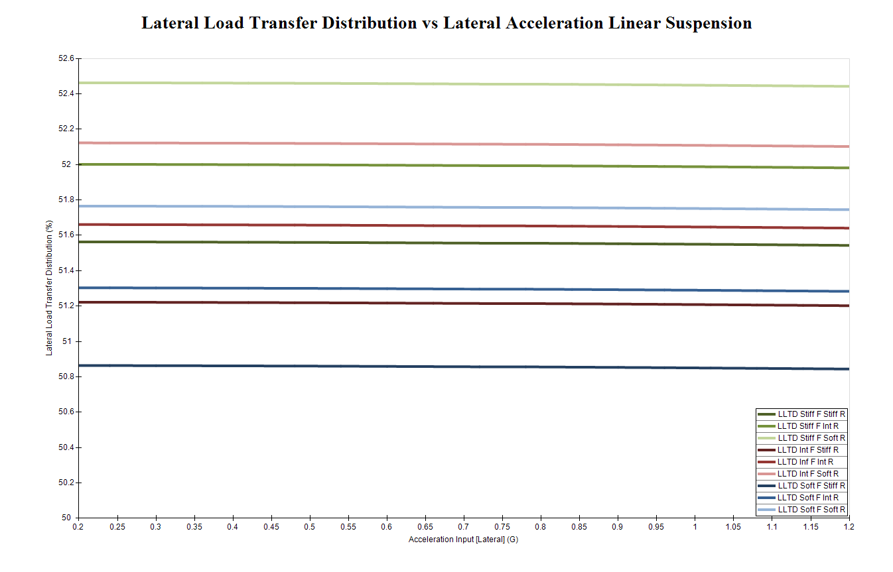
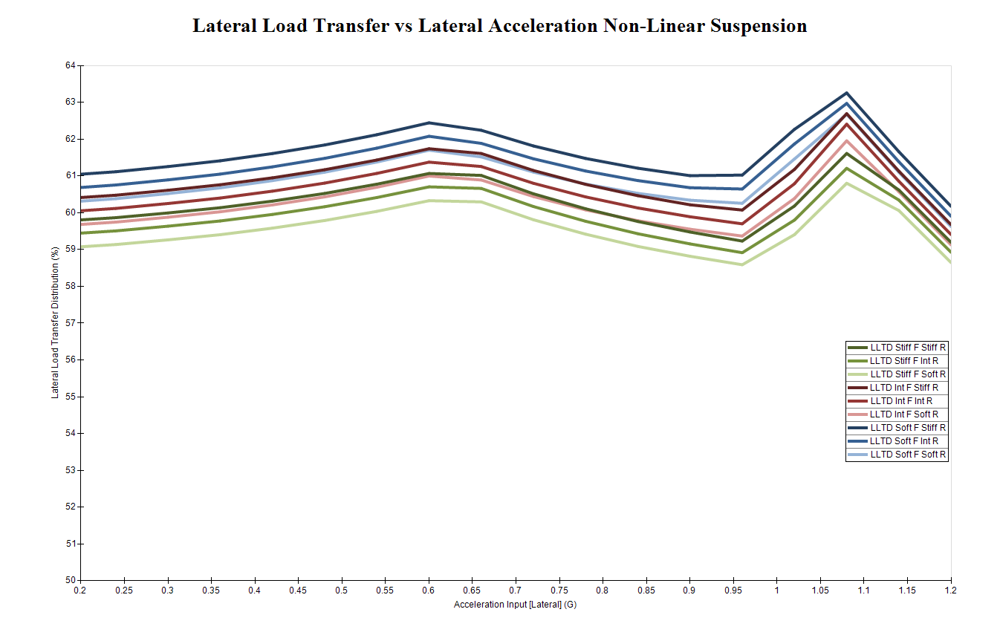
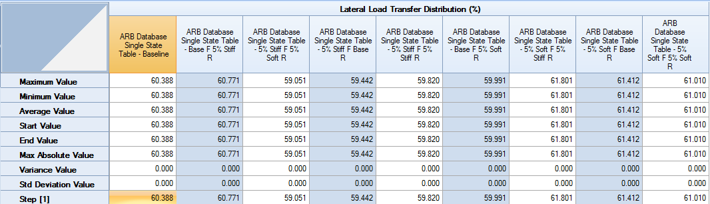
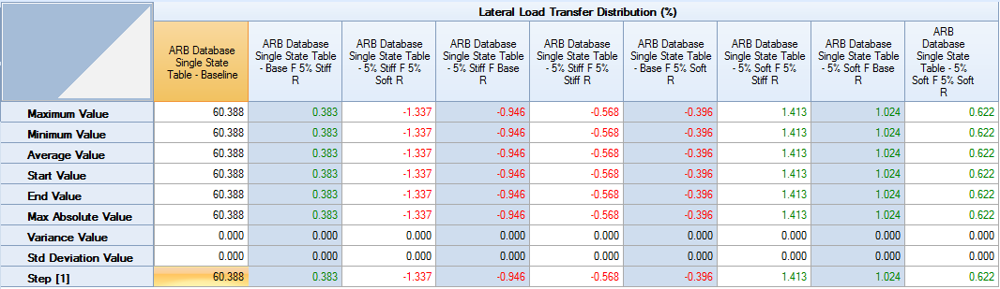
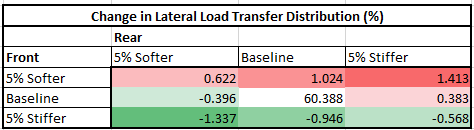

####[Return To Case Studies](../Case_Studies.md)

#Creating Databases using OptimumDynamics

OptimumDynamics can be used to predict the behavior of a vehicle for different setup changes. In this study the effects of the vehicle anti-roll bar (ARB) on percent front lateral load transfer distribution (LLTD) is investigated. This study creates a database of possible ARB combinations, providing the race engineer a reference tool that they can use when making setup changes at the track. The vehicle being investigated is a later model GT racecar. For this analysis we will use the batch simulation tool in OptimumDynamics to model three different front and rear Anti-Roll Bars. The analysis of LLTD has been chosen because it can be related to vehicle balance. If the vehicle is not behaving in the desired manner then the LLTD can be adjusted to change the vehicle balance.

For this analysis we are simulating a cornering scenario. To achieve this, we are sweeping from 0G to 1.2G in lateral acceleration with a constant speed of 150km/h. Batch simulations were run showing the sensitivity of the vehicle to a 5% change in bar stiffness.

More information on the __[batch simulation](../Tutorial_3_Modifying_Vehicle_Setup/5_BatchSim.md)__ and the __[acceleration sweep](../Tutorial_2_Vehicle_Simulation/4_Multi_Step_Sim.md)__ can be found in our __tutorials__.

Plots for each of the simulation types can be seen above. The 2D chart is useful for visualizing the relationship between two outputs. For this chart we chose to show the how the LLTD varies for the given input acceleration. Note that when the simulations were created with a linear suspension, the dynamics of the anti-roll bar motion are considered constant, resulting in no change in LLTD. The variance in the acutal distribution is also changed by the calculation of the motion ratio of the geometry. However, when the results are completed with a Non-Linear suspension, the results show a gradual increase of as much as 4% with the increase in Lateral Acceleration, then drop off significantly when the suspension reaches 1G of acceleration. This is an example of how OptimumDynamics is able to take into account the effects of non-linear motion ratios and non-linear spring rates.

Further analysis of the system can be completed within a table function. We used the Non-Linear Suspension Geometry and the 5% batch simulation that was used to create the plots. A single state !G Lateral Acceleration Simulation was used for this test. This was used as it does not take into account the drop off that occurred at the higher lateral acceleration for this speed. A comparison table was then created within OptimumDynamics.

Looking at the table below it can be easily seen that the different combinations of ARB’s will give different LLTD. The changes themselves become much more apparent when the comparison function is turned on for the table.

A higher LLTD would tend towards an understeering vehicle. Therefore, the green cells correspond to a greater amount of understeer in the vehicle. By looking at the actual values of LLTD we see changes are roughly between 61.5% and 59% from one cell to the next cell, which is a noticeable difference for a driver. With these ARB settings the overall spread of LLTD is 2.75%, meaning a significant handling change is possible with only a small amount of change in the anti-roll bar stiffness. The table can then be exported to create a graphical setup sheet using Excel.

In this study the effects of possible ARB setups were collected using both a linear vehicle setup and a nonlinear suspesnion. From these results a simple setup tool was created which can be brought to and used at the racetrack. Much like this study of ARB combinations, any setup combination can be studied. The tools and graphical results options of OptimumDynamics allow the user to take the content from their simulations and effectively input it into a system for on track analysis.

For more information on ordering OptimumDynamics, check out ().

For more information on the concepts discussed in the case study, check out our seminars at ().

###[Next Case Study: Using a Track Study](../Case_Study_2_Track_Study/1_Case_2.md)