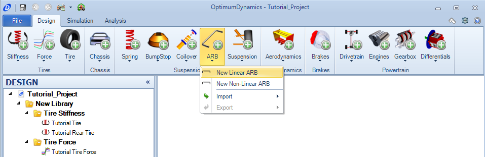
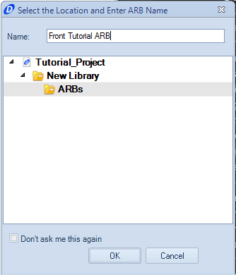
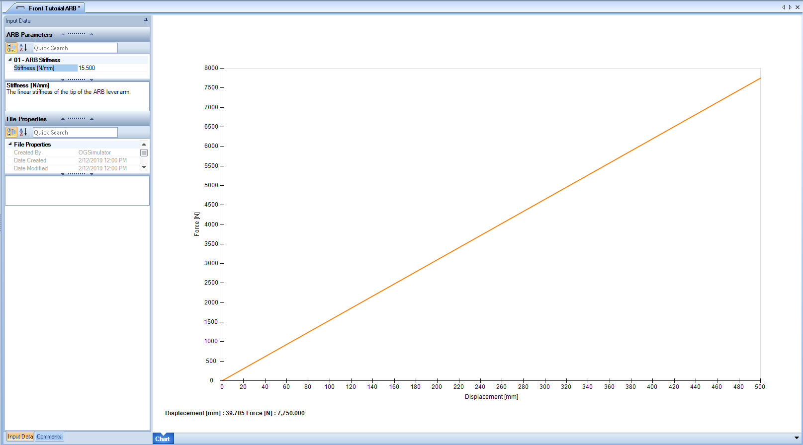

[Return to Start](1_Tutorial_1.md)

-|-|-|-
[Goals](../1_Goals.md)|[Tire Stiffness](../3_Tire_Stiffness.md)|[Tire Friction](../4_Tire_Friction.md)|[Tire Assembly](../5_TireAssy.md)
[Chassis](../6_Chassis.md)|[Spring](../7_Spring.md)|[Bump Stop](../8_BumpStop.md)|[Coilover](../9_Coilover.md)
[Anti-Roll Bar](../10_ARB.md)|[Linear Suspension](../11_LinearSus.md)|[Aerodynamics](../12_Aero.md)|[Brakes](../13_Brakes.md)
[Differential](../14_Diff.md)|[Drivetrain](../15_DT.md)|[Powertrain](../16_Powertrain.md)|[Gearbox](../17_Gearbox.md)
[Introduction to Setup](../18_Setupintro.md)|[Creating a Setup](../19_Setup.md)|[Validating a Setup](../20_ValidateSetup.md)|[Conclusion](../21_Conclusion.md)

#Anti Roll Bar

Anti-roll bars are designed to help react the moment created by the inert force of the vehicle reacting to the lateral force developed by the tire.  The following procedure is needed to create an anti-roll bar in OptimumDynamics:

1) Select the __Anti-Roll Bar__ button along the __Command Ribbon__ and choose the __Linear ARB__ option

2) Provide a name for the Anti-Roll bar within the prompt.

3) Input the the above stiffness for the Anti-Roll Bar

4) Create a second Anti-Roll bar for the rear using the stiffness 16 N/mm.  Use any of the methods for creating a second component previously described.

