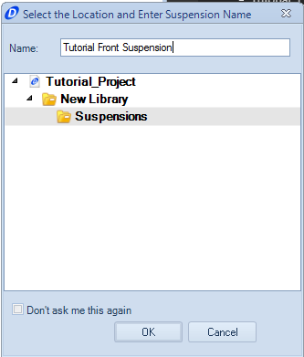

####[Return to Start](1_Tutorial_1.md)

1) [Create Project](2_Create_Project.md)|2) [Tire Stiffness](3_Tire_Stiffness.md)|3) [Tire Friction](4_Tire_Friction.md)|4) [Tire Assembly](5_TireAssy.md)
-|-|-|-
__5) [Chassis](6_Chassis.md)__|__6) [Spring](7_Spring.md)__|__7) [Bump Stop](8_BumpStop.md)__|__8) [Coilover](9_Coilover.md)__
__9) [Anti-Roll Bar](10_ARB.md)__|__10) [Linear Suspension](11_LinearSus.md)__|__11) [Aerodynamics](12_Aero.md)__|__12) [Brakes](13_Brakes.md)__
__13) [Differential](14_Diff.md)__|__14) [Drivetrain](15_DT.md)__|__15) [Powertrain](16_Powertrain.md)__|__16) [Gearbox](17_Gearbox.md)__
__17) [Introduction to Setup](18_Setupintro.md)__|__18) [Creating a Setup](19_Setup.md)__|__19) [Validating a Setup](20_ValidateSetup.md)__|__20) [Conclusion](21_Conclusion.md)__

#Linear Suspension

The linear suspension defines a layout and motion of the vehicle when the hard points and actuation are not fully known. The following steps are completed to create a linear suspension.  Details on creating a non-linear suspension can be found in the help file [here](https://optimumdynamicshelp.readthedocs.io/en/latest/#2_Detailed_Guide/B_Understanding_Vehicle_Design/#non-linear-suspension) and in the case study [here](../Case_Study_6_Developing_a_Non-Linear_Suspension/1_Case_6.md)

To create the Linear Suspension:

1) Click on the __Add Suspension__ button and select the __New Linear Suspension__ option.

2) We will start with the front suspension, so name the suspension as listed above.

3) Notice that there are currently two planes that act as the suspension.  These will spread out depending on the vehicle track width and adjust

4) Input the following parameters in the left hand column.  Also select the front tire and the front coilover.  The suspension should look like the one above when done.

You will notice that the steering ratio does not follow the normal nomenclature.  To convert the manufacturer provided steering ratio to the OptimumDynamics ratio nomenclature, take the inverse of the provided ration (e.g. a 32:1 steering ratio from the manufacturer becomes 0.031)

5) The rear suspension can be created using the same methodology as above.  Make sure that the steering ratio is not input.

6) The rear suspension parameters should be the same as above.  Once complete, the suspension can be saved.

###[Next: Aerodynamics](12_Aero.md)
--------------------------------------------------------
###[Previous: Anti-Roll Bar](10_ARB.md)