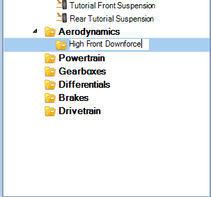
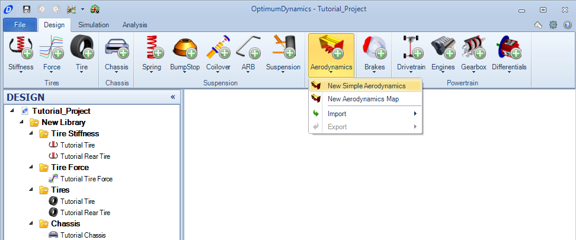
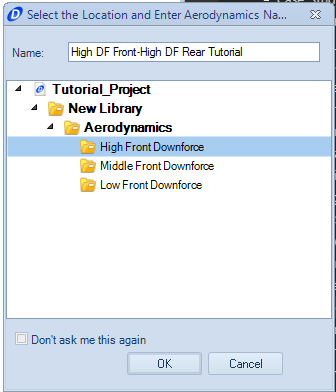
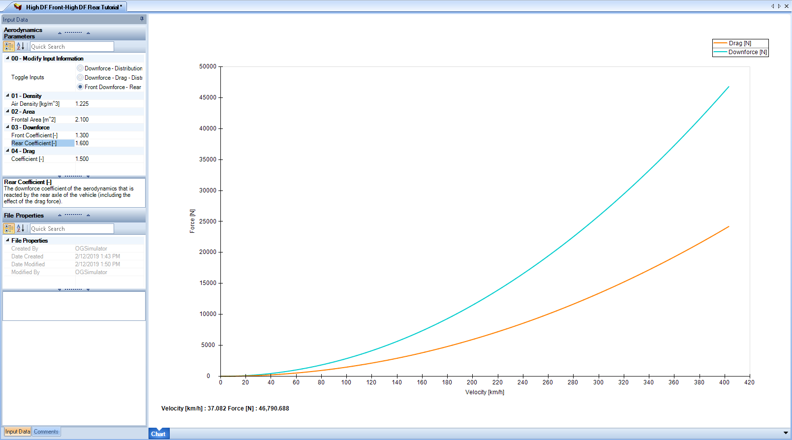
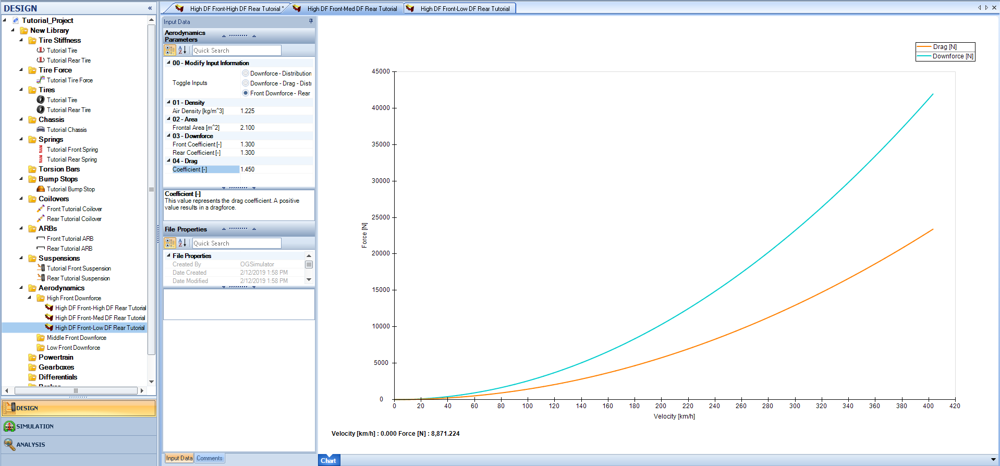
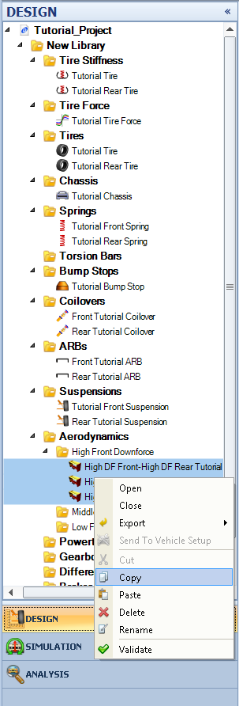

####[Return to Start](1_Tutorial_1.md)

1) [Create Project](2_Create_Project.md)|2) [Tire Stiffness](3_Tire_Stiffness.md)|3) [Tire Friction](4_Tire_Friction.md)|4) [Tire Assembly](5_TireAssy.md)
-|-|-|-
__5) [Chassis](6_Chassis.md)__|__6) [Spring](7_Spring.md)__|__7) [Bump Stop](8_BumpStop.md)__|__8) [Coilover](9_Coilover.md)__
__9) [Anti-Roll Bar](10_ARB.md)__|__10) [Linear Suspension](11_LinearSus.md)__|__11) [Aerodynamics](12_Aero.md)__|__12) [Brakes](13_Brakes.md)__
__13) [Differential](14_Diff.md)__|__14) [Drivetrain](15_DT.md)__|__15) [Powertrain](16_Powertrain.md)__|__16) [Gearbox](17_Gearbox.md)__
__17) [Introduction to Setup](18_Setupintro.md)__|__18) [Creating a Setup](19_Setup.md)__|__19) [Validating a Setup](20_ValidateSetup.md)__|__20) [Conclusion](21_Conclusion.md)__

#Two Dimensional Aerodynamics

The vehicle we are using has three different options for its aerodynamic package.  A low, medium, and high downforce and drag option.  Our GT car will have negligible downforce and drag sensitivity to ride height, so we can use the 2D aerodynamics model.  We will be using a database to show the different options available for the car.  Here are the steps to create the components.

1) We will start by creating three folders, based off the downforce made at the front.  In the __Project Tree__, right click on the __Aerodynamics__ folder and select __Create -> New Folder__.

2) Name the foldrr that will correspond with the components coallated.  Repeat for the other two folders.

3) Once the folders are created, go to the __Aerodynamics__ button and select the __New Simple Aerodynamics__ option

4) Input the name for the aerodynamics file, and highlight the folder that the file will be a part of, then click __OK__.

5) Input the frontal area for the vehicle as 2.1 m^2.

6) We will put the downforce in as front and rear downforce coefficients to clarify the different downforce packages.  Input the values for the first iteration of the Aerodynamics package.  Input the drag coefficient as well.

7) We can now do the next two options for the high downforce front packages.  __Copy__ the initial package and rename the copy.

8) Change the rear downforce coefficient from 1.6 to 1.3 and save the second iteration.  Adjust the drag coefficient from 1.5 to 1.45

9) Create one more iteration for the high front downforce. This time, change the rear downforce coefficient to 0.9. Set the drag coefficient to 1.4. We can now close the first iterations.

10) We can now copy over the three components created in the high downforce folder and paste them into the next two folders to modify. Select multiple components to copy by holding __Shift + Click__

11) __Right click__ then select copy.

12) Select the folder to paste in.  __Right click__ then select __Paste__.  Repeat for the final folder.

13) For the medium front downforce, set the front downforce coefficient to 1.1.  Medium-Front High-Rear will have a drag coefficient of 1.4.  Medium-Front Medium-Rear will have a drag coefficient of 1.35.  Medium-Front Low-Rear will have a drag coefficient of 1.3.

14) The front low downforce coefficient at the front will be 1.0.  Low-Front High-Rear will have a drag coefficient of 1.1. Low-Front Medium-Rear will have a drag coefficient of 1.05. Low-Front Low-Rear will have a drag coefficient of 1.0.  The values are also summerized in the table below.

Front Downforce Coefficient|Rear Downforce Coefficient|Drag Coefficient
-|-|-
1.3|1.6|1.50
1.3|1.3|1.45
1.3|0.9|1.40
1.1|1.6|1.40
1.1|1.3|1.35
1.1|0.9|1.30
1.0|1.6|1.10
1.0|1.3|1.05
1.0|0.9|1.00

###[Next: Brakes](13_Brakes.md)
--------------------------------------------------------
###[Previous: Linear Suspension](11_LinearSus.md)