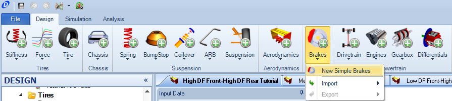
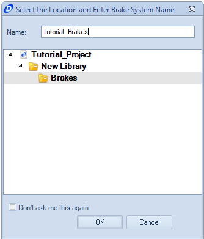
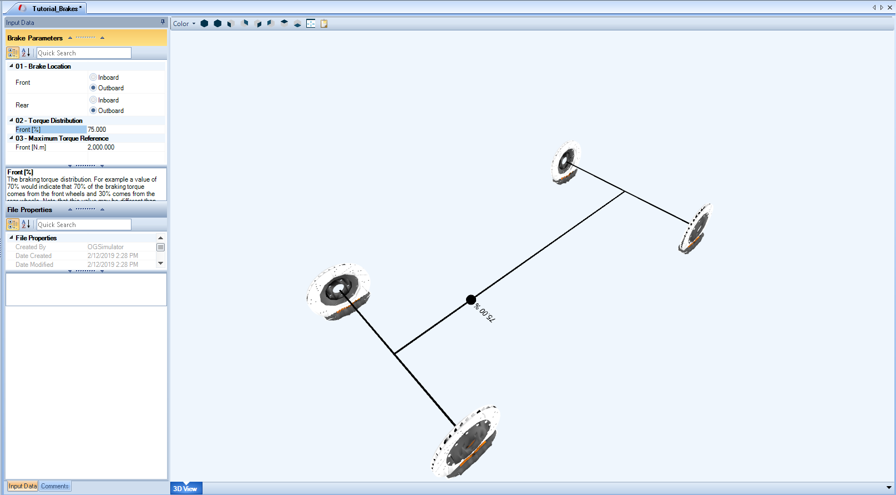

####[Return to Start](1_Tutorial_1.md)

1) [Create Project](2_Create_Project.md)|2) [Tire Stiffness](3_Tire_Stiffness.md)|3) [Tire Friction](4_Tire_Friction.md)|4) [Tire Assembly](5_TireAssy.md)
-|-|-|-
__5) [Chassis](6_Chassis.md)__|__6) [Spring](7_Spring.md)__|__7) [Bump Stop](8_BumpStop.md)__|__8) [Coilover](9_Coilover.md)__
__9) [Anti-Roll Bar](10_ARB.md)__|__10) [Linear Suspension](11_LinearSus.md)__|__11) [Aerodynamics](12_Aero.md)__|__12) [Brakes](13_Brakes.md)__
__13) [Differential](14_Diff.md)__|__14) [Drivetrain](15_DT.md)__|__15) [Powertrain](16_Powertrain.md)__|__16) [Gearbox](17_Gearbox.md)__
__17) [Introduction to Setup](18_Setupintro.md)__|__18) [Creating a Setup](19_Setup.md)__|__19) [Validating a Setup](20_ValidateSetup.md)__|__20) [Conclusion](21_Conclusion.md)__

#Brakes

The braking system of the vehicle can be defined simply by the location of the brakes and the distribution of braking force front to rear.  The braking distribution is assumed to be constant in this model and does not depend on the hydraulics of the vehicle.  The option is also available to input a bespoke value for brakes, though we will not be doing that for this model.  Details on how to calculate the specific brake torque for a vehicle can be found [here](https://optimumdynamicshelp.readthedocs.io/en/latest/#2_Detailed_Guide/B_Understanding_Vehicle_Design/#simple-brakes)

To create the brakes:

1) Click on the __Add Brakes__ button and select the __New Simple Brakes__ option.

2) Input the name for the brakes file in the input box

3) Set the brakes parameters based on the input data presented above.

###[Next: Tire Stiffness](3_Tire_Stiffness.md)

###[Previous: Table of Contents](1_Tutorial_1.md)