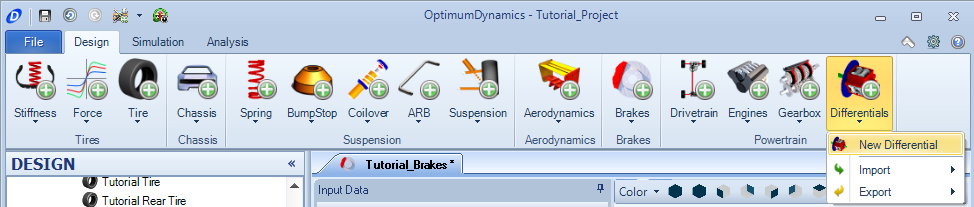
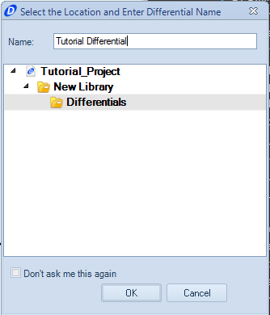
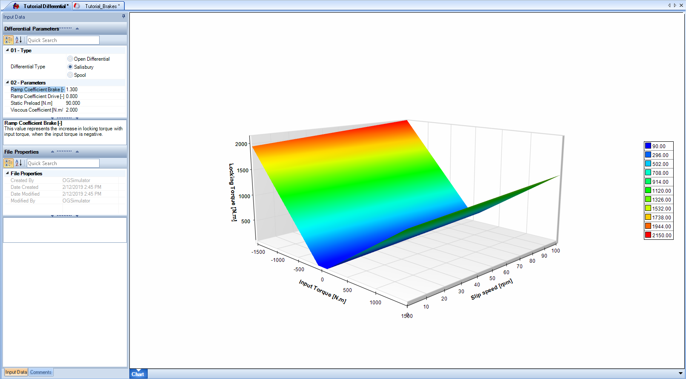

####[Return to Start](1_Tutorial_1.md)

1) [Create Project](2_Create_Project.md)|2) [Tire Stiffness](3_Tire_Stiffness.md)|3) [Tire Friction](4_Tire_Friction.md)|4) [Tire Assembly](5_TireAssy.md)
-|-|-|-
__5) [Chassis](6_Chassis.md)__|__6) [Spring](7_Spring.md)__|__7) [Bump Stop](8_BumpStop.md)__|__8) [Coilover](9_Coilover.md)__
__9) [Anti-Roll Bar](10_ARB.md)__|__10) [Linear Suspension](11_LinearSus.md)__|__11) [Aerodynamics](12_Aero.md)__|__12) [Brakes](13_Brakes.md)__
__13) [Differential](14_Diff.md)__|__14) [Drivetrain](15_DT.md)__|__15) [Powertrain](16_Powertrain.md)__|__16) [Gearbox](17_Gearbox.md)__
__17) [Introduction to Setup](18_Setupintro.md)__|__18) [Creating a Setup](19_Setup.md)__|__19) [Validating a Setup](20_ValidateSetup.md)__|__20) [Conclusion](21_Conclusion.md)__

#Differential

The differential is used to distribute the torque between the left and right wheels.  The differential we will be using for our tutorial is a limited-slip salisbury differential.  To create the differential:

1) Select the __Differential__ button and choose the __New Differential__ option.

2) Set a name for the differential as above, and click __OK__

3) Choose the __Salisbury__ option under __Type__

4) Set the parameters for the ramp coefficient, coast coefficient, preload, and viscous coefficient as found above.

###[Next: Tire Stiffness](3_Tire_Stiffness.md)

###[Previous: Table of Contents](1_Tutorial_1.md)