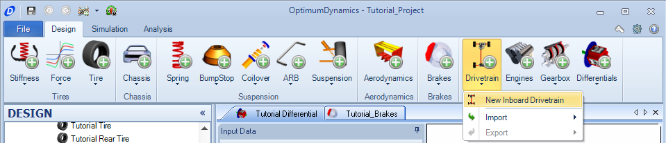
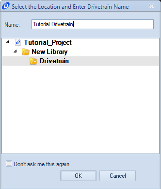
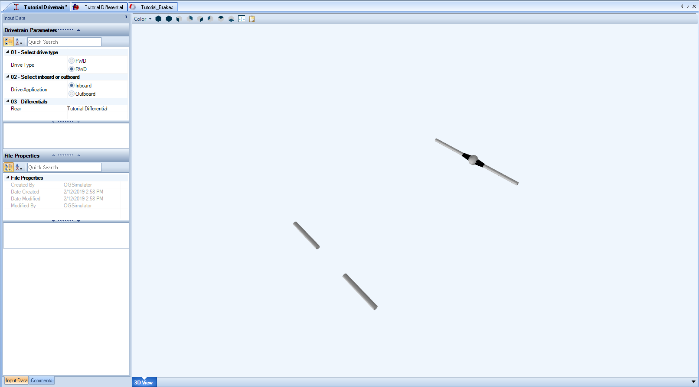

[Return to Start](1_Tutorial_1.md)

-|-|-|-
[Create Project](2_Create_Project.md)|[Tire Stiffness](3_Tire_Stiffness.md)|[Tire Friction](4_Tire_Friction.md)|[Tire Assembly](5_TireAssy.md)
[Chassis](6_Chassis.md)|[Spring](7_Spring.md)|[Bump Stop](8_BumpStop.md)|[Coilover](9_Coilover.md)
[Anti-Roll Bar](10_ARB.md)|[Linear Suspension](11_LinearSus.md)|[Aerodynamics](12_Aero.md)|[Brakes](13_Brakes.md)
[Differential](14_Diff.md)|[Drivetrain](15_DT.md)|[Powertrain](16_Powertrain.md)|[Gearbox](17_Gearbox.md)
[Introduction to Setup](18_Setupintro.md)|[Creating a Setup](19_Setup.md)|[Validating a Setup](20_ValidateSetup.md)|[Conclusion](21_Conclusion.md)

#Drivetrain

The drivetrain sets where drive application is on the vehicle.

To create the drivetrain:

1) Select the __Drivetrain__ button on the Commnad ribbon and choose the __New Inboard Drivetrain__.

2) Input the name for the drivetrain as listed above.

3) Set the torque application to be __inboard__ and drive application to be the __rear__ wheels. Set the differential to be the previously made differential.