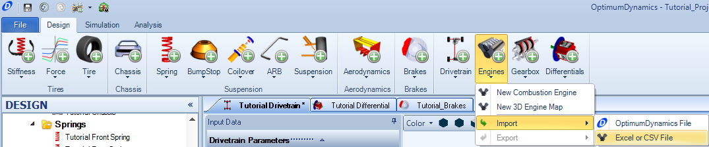
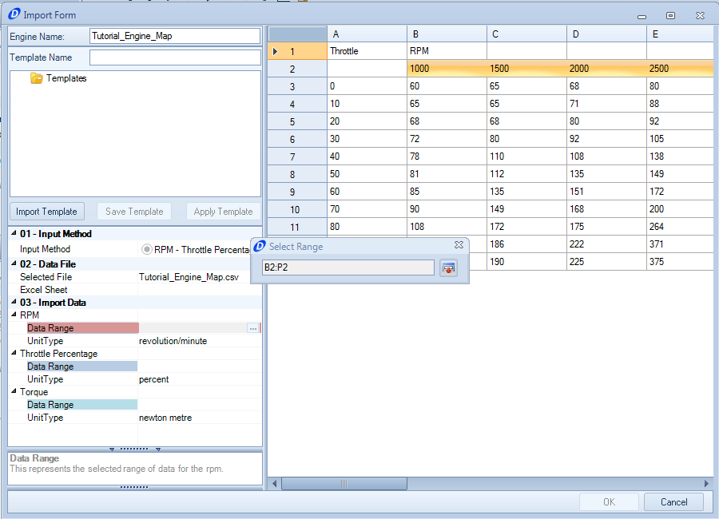
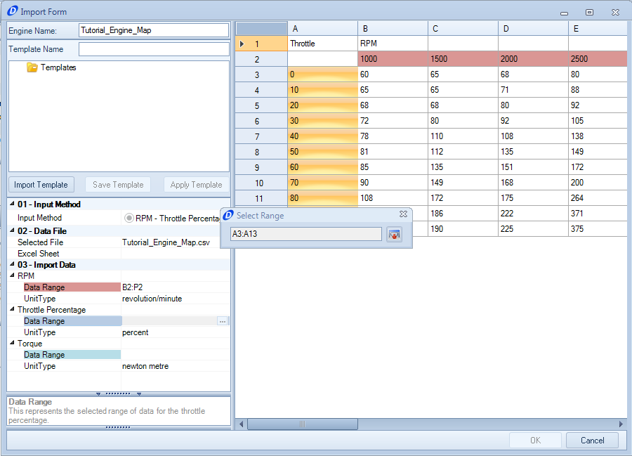
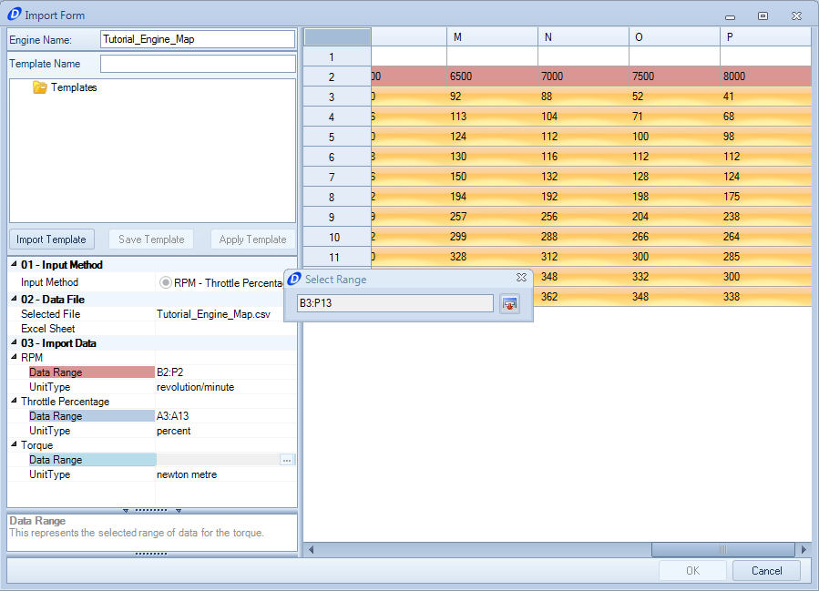
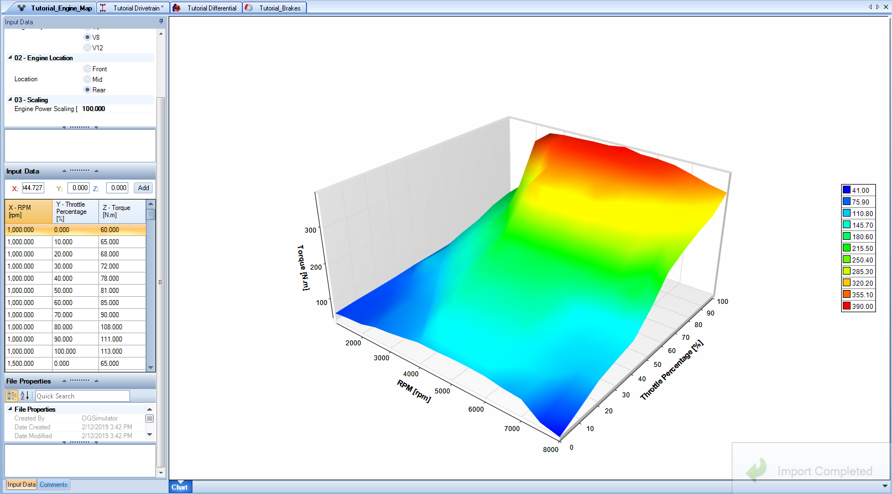

####[Return to Start](1_Tutorial_1.md)

1) [Create Project](2_Create_Project.md)|2) [Tire Stiffness](3_Tire_Stiffness.md)|3) [Tire Friction](4_Tire_Friction.md)|4) [Tire Assembly](5_TireAssy.md)
-|-|-|-
__5) [Chassis](6_Chassis.md)__|__6) [Spring](7_Spring.md)__|__7) [Bump Stop](8_BumpStop.md)__|__8) [Coilover](9_Coilover.md)__
__9) [Anti-Roll Bar](10_ARB.md)__|__10) [Linear Suspension](11_LinearSus.md)__|__11) [Aerodynamics](12_Aero.md)__|__12) [Brakes](13_Brakes.md)__
__13) [Differential](14_Diff.md)__|__14) [Drivetrain](15_DT.md)__|__15) [Powertrain](16_Powertrain.md)__|__16) [Gearbox](17_Gearbox.md)__
__17) [Introduction to Setup](18_Setupintro.md)__|__18) [Creating a Setup](19_Setup.md)__|__19) [Validating a Setup](20_ValidateSetup.md)__|__20) [Conclusion](21_Conclusion.md)__

#Powertrain

The engine map can be set as a function of throttle position and the rotational speed of the engine.  For this tutorial, the engine map has been created and made available for download [here]<a href="../Tutorial_Engine_Map.csv">

To import the engine file into OptimumDynamics, follow the following steps:

1) In the __Command Ribbon__, click the __Engines__ button, and select __Import->Excel or .csv__

2) Select the file from its download location

3) Select the row that corresponds to the data for the rotational speed of the engine.

4) Select the column that corresponds to the data for the throttle position

5) Select the data that corresponds to the data for the torque.  Note that this is going to be both row and column data.

6) Click __OK__ on the bottom left hand of the import window.  Afterwards, the engine map should look comparable to the map shown above.

###[Next: Tire Stiffness](3_Tire_Stiffness.md)

###[Previous: Table of Contents](1_Tutorial_1.md)