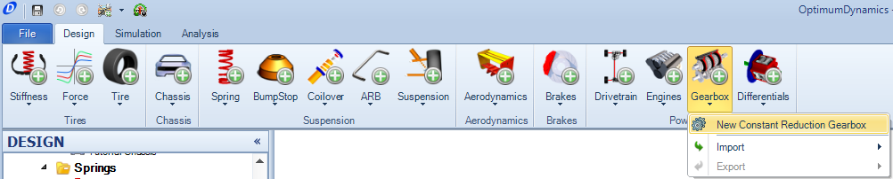
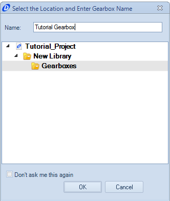
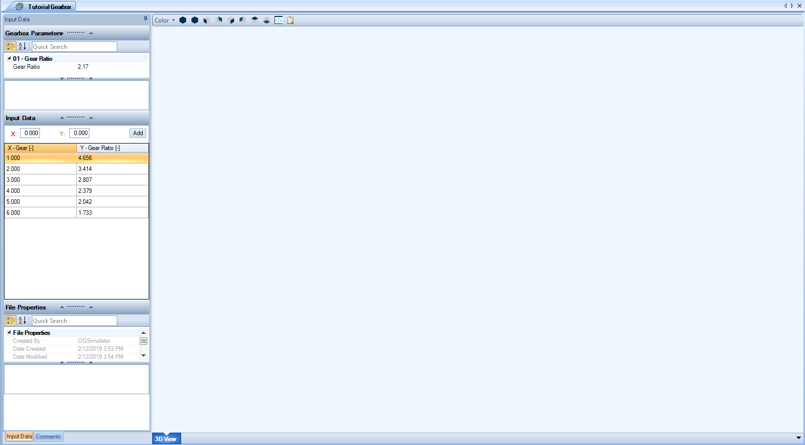

####[Return to Start](1_Tutorial_1.md)

1) [Create Project](2_Create_Project.md)|2) [Tire Stiffness](3_Tire_Stiffness.md)|3) [Tire Friction](4_Tire_Friction.md)|4) [Tire Assembly](5_TireAssy.md)
-|-|-|-
__5) [Chassis](6_Chassis.md)__|__6) [Spring](7_Spring.md)__|__7) [Bump Stop](8_BumpStop.md)__|__8) [Coilover](9_Coilover.md)__
__9) [Anti-Roll Bar](10_ARB.md)__|__10) [Linear Suspension](11_LinearSus.md)__|__11) [Aerodynamics](12_Aero.md)__|__12) [Brakes](13_Brakes.md)__
__13) [Differential](14_Diff.md)__|__14) [Drivetrain](15_DT.md)__|__15) [Powertrain](16_Powertrain.md)__|__16) [Gearbox](17_Gearbox.md)__
__17) [Introduction to Setup](18_Setupintro.md)__|__18) [Creating a Setup](19_Setup.md)__|__19) [Validating a Setup](20_ValidateSetup.md)__|__20) [Conclusion](21_Conclusion.md)__

#Gearbox

The last component to set parameters for is the gearbox.  This sets the torque ratio that is applied to the rear wheels for a given instance in the simulation.

To set the gear ratios:

1) Click on the __Gearbox__ button and choose the __New Constant Reduction Gearbox__ option.

2) Set the name for the gearbox and click __OK__

3) Set the final drive and each of the ratios as follow above.

Everything should now be all set to create the setup. Check now for any missing components

###[Next: Introduction to Setup](18_Setupintro.md)
--------------------------------------------------------
###[Previous: Powertrain](16_Powertrain.md)