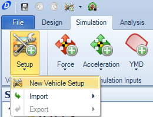

####[Return to Start](1_Tutorial_1.md)

1) [Create Project](2_Create_Project.md)|2) [Tire Stiffness](3_Tire_Stiffness.md)|3) [Tire Friction](4_Tire_Friction.md)|4) [Tire Assembly](5_TireAssy.md)
-|-|-|-
__5) [Chassis](6_Chassis.md)__|__6) [Spring](7_Spring.md)__|__7) [Bump Stop](8_BumpStop.md)__|__8) [Coilover](9_Coilover.md)__
__9) [Anti-Roll Bar](10_ARB.md)__|__10) [Linear Suspension](11_LinearSus.md)__|__11) [Aerodynamics](12_Aero.md)__|__12) [Brakes](13_Brakes.md)__
__13) [Differential](14_Diff.md)__|__14) [Drivetrain](15_DT.md)__|__15) [Powertrain](16_Powertrain.md)__|__16) [Gearbox](17_Gearbox.md)__
__17) [Introduction to Setup](18_Setupintro.md)__|__18) [Creating a Setup](19_Setup.md)__|__19) [Validating a Setup](20_ValidateSetup.md)__|__20) [Conclusion](21_Conclusion.md)__

#Developing a Vehicle Setup

1) To create a vehicle setup, the __Command Ribbon__ needs to be set to the __Simulation__ tab.

2) Click on the __Setup__ button and choose the __New Setup__ option

3) Provide a name for the setup being used.  Since this is our first setup, we will call it our baseline.

4) The user interface of the setup section is similar to other assembly components that we have already worked with. 

5) The first thing we will want to set is the reference distance. This will suffice as our wheelbase for this vehicle 

6) We can now go through with each component and add the components created in the design interface

5) The aerodynamics package we will be using for our baseline is the High-Front Downforce and the Medium Rear Downforce

6) After all the components are input, the assembly should look as described above

###[Next: Tire Stiffness](3_Tire_Stiffness.md)

###[Previous: Table of Contents](1_Tutorial_1.md)