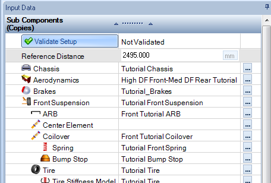
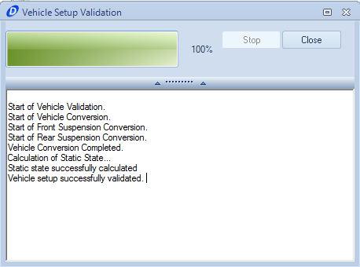

[Return to Start](1_Tutorial_1.md)

-|-|-|-
[Goals](../1_Goals.md)|[Tire Stiffness](../3_Tire_Stiffness.md)|[Tire Friction](../4_Tire_Friction.md)|[Tire Assembly](../5_TireAssy.md)
[Chassis](../6_Chassis.md)|[Spring](../7_Spring.md)|[Bump Stop](../8_BumpStop.md)|[Coilover](../9_Coilover.md)
[Anti-Roll Bar](../10_ARB.md)|[Linear Suspension](../11_LinearSus.md)|[Aerodynamics](../12_Aero.md)|[Brakes](../13_Brakes.md)
[Differential](../14_Diff.md)|[Drivetrain](../15_DT.md)|[Powertrain](../16_Powertrain.md)|[Gearbox](../17_Gearbox.md)
[Introduction to Setup](../18_Setupintro.md)|[Creating a Setup](../19_Setup.md)|[Validating a Setup](../20_ValidateSetup.md)|[Conclusion](../21_Conclusion.md)

#Validating a Vehicle Setup

The setup is now ready to be validated.  This takes the assembly created and tests the feasibility of the assembly in full compression, full extension, full steering lock, and the resting point of the vehicle under the influence of gravity only.

There is only one step to validate the setup, which is to click the embedded __Validate Setup__ button shown above

When the setup is validating, the above window will show, if everything solved, the setup can be used for simulation.

If there was an error in validation, the error will be listed in the validation window.

An error in front suspension means that the suspension cannot fully travel in extension or compression (not applicable for a linear suspension)

An error in static state means that there is a likely a spring rate that does not yield a feasible state

If there are no more issues, then you are ready to move on to the next tutorial!