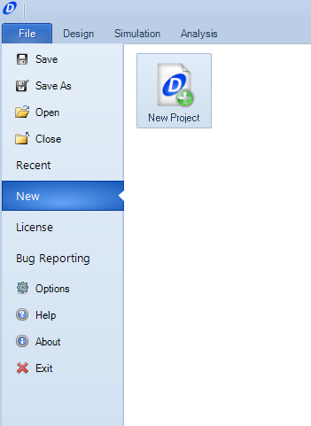
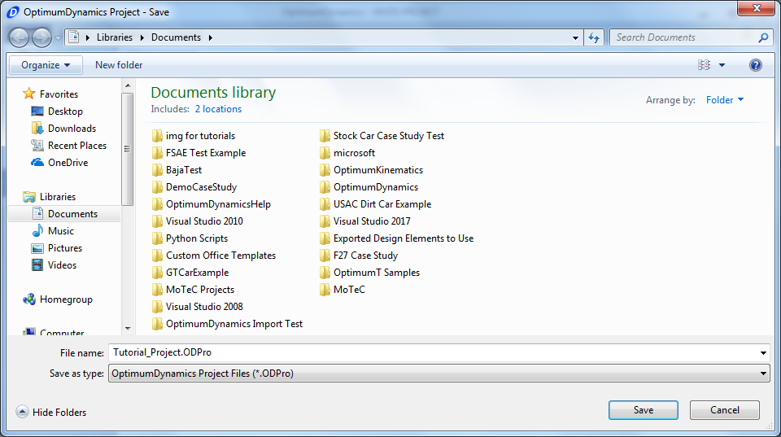
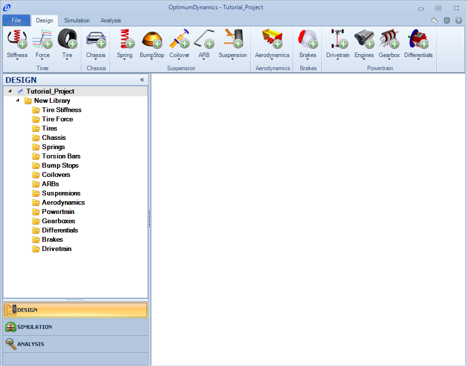

[Return to Start](1_Tutorial_1.md)

-|-|-|-
[Create Project](2_Create_Project.md)|[Tire Stiffness](3_Tire_Stiffness.md)|[Tire Friction](4_Tire_Friction.md)|[Tire Assembly](5_TireAssy.md)
[Chassis](6_Chassis.md)|[Spring](7_Spring.md)|[Bump Stop](8_BumpStop.md)|[Coilover](9_Coilover.md)
[Anti-Roll Bar](10_ARB.md)|[Linear Suspension](11_LinearSus.md)|[Aerodynamics](12_Aero.md)|[Brakes](13_Brakes.md)
[Differential](14_Diff.md)|[Drivetrain](15_DT.md)|[Powertrain](16_Powertrain.md)|[Gearbox](17_Gearbox.md)
[Introduction to Setup](18_Setupintro.md)|[Creating a Setup](19_Setup.md)|[Validating a Setup](20_ValidateSetup.md)|[Conclusion](21_Conclusion.md)

We will start with the first step which is to create the project.  In order to start a project, your OptimumDynamics license must be input.  If it is not, details of how to do so can be found [here](https://optimumdynamicshelp.readthedocs.io/en/latest/#1_Getting_Started/C_Licensing/)

When you first start OptimumDynamics you will see the project Backstage.

1) Click __New Project__

Type in *Tutorial Project* as the file name and select a file location to save the project.  

Once you have created the project you will find yourself in the main graphical user interface (GUI) screen. At the top of the screen you will see the __Ribbon Control__ menu. To the left of the screen is the __Project Tree__. To the right of the screen is the __Document Manager__. Optimum Dynamics is setup so you work from left to right in the ribbon control. In this tutorial we will follow this process working across the ribbon control to design a vehicle.

If you understand so far, it is time to create our first component __[tires](3_Tire_Stiffness.md)__