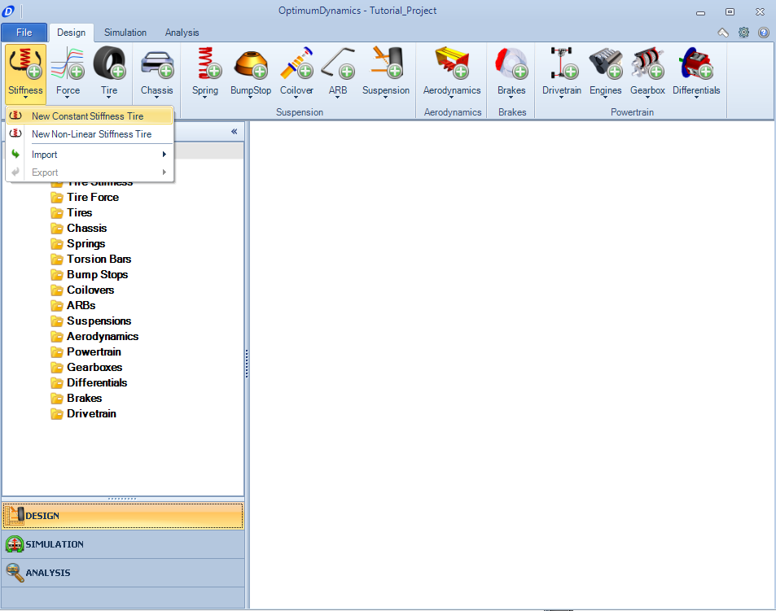
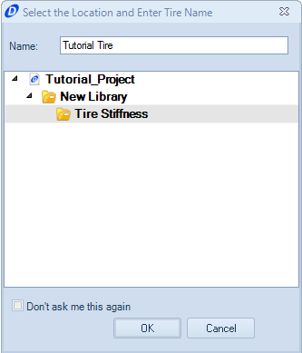
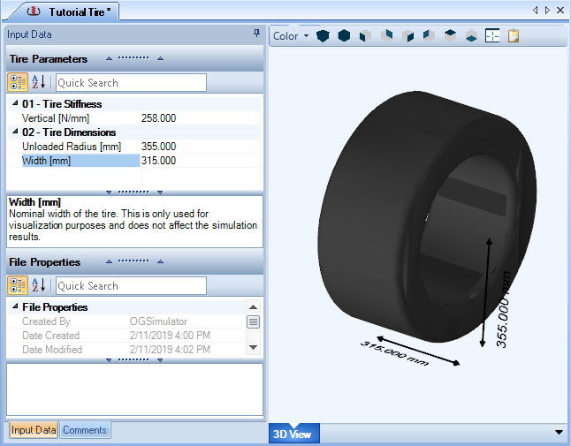
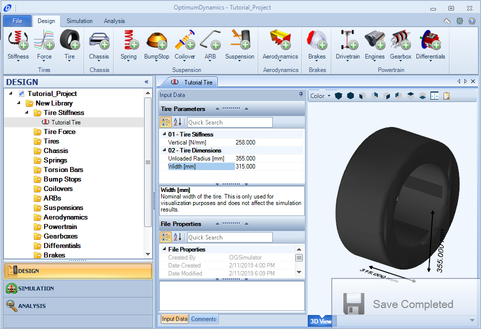

[Return to Start](1_Tutorial_1.md)

-|-|-|-
[Create Project](../2_Create_Project.md)|[Tire Stiffness](../3_Tire_Stiffness.md)|[Tire Friction](../4_Tire_Friction.md)|[Tire Assembly](../5_TireAssy.md)
[Chassis](../6_Chassis.md)|[Spring](../7_Spring.md)|[Bump Stop](../8_BumpStop.md)|[Coilover](../9_Coilover.md)
[Anti-Roll Bar](../10_ARB.md)|[Linear Suspension](../11_LinearSus.md)|[Aerodynamics](../12_Aero.md)|[Brakes](../13_Brakes.md)
[Differential](../14_Diff.md)|[Drivetrain](../15_DT.md)|[Powertrain](../16_Powertrain.md)|[Gearbox](../17_Gearbox.md)
[Introduction to Setup](../18_Setupintro.md)|[Creating a Setup](../19_Setup.md)|[Validating a Setup](../20_ValidateSetup.md)|[Conclusion](../21_Conclusion.md)

#Tire Stiffness

We start by creating a tire stiffness model. The tire stiffness is calculated as the vertical change in tire radius versus the load applied to it, with a standard unit of Newtons/millimeter. The constant tire stiffness model assumes that the tire vertical stiffness is a constant and unchanging parameter. To create the model:

1) Click on the __Stiffness button__ in the Tires section and select __New Constant Stiffness__ Tire.

2) Name your Stiffness model and click OK. The Stiffness model will save in the Tire Stiffness folder in the Library. The inputs will show in the Document Manager section of the GUI. 

3) Enter the Vertical Stiffness, Unloaded radius, and Width of the Tire as seen in the above image. Notice the tool tip that appears in the lower box of the Tire Parameters section. This tooltip box gives some useful information about what information to input. 

Also notice the asterisk that appears after the tab name. This indicates that an input has been modified but has not yet been saved.

4) Press the Save button in the backstage or press “Ctrl+S” to save your changes to the project. Notice that the asterisk is now gone. You should save your project frequently to reduce the risk of lost data. 

5) At the far right of the Document Manager there is a Close button. You can choose to close component documents to reduce the number of open tabs.

6) Our vehicle runs different tires front and rear, therefore, we need to create a second tire stiffness.  Repeat steps 1-4 using these parameters:

Vertical Stiffness|Unloaded Radius|Width
-|-|-
283 N/mm|355mm|325mm

Once you have the two tire stiffnesses input, you are ready to move onto the next step.