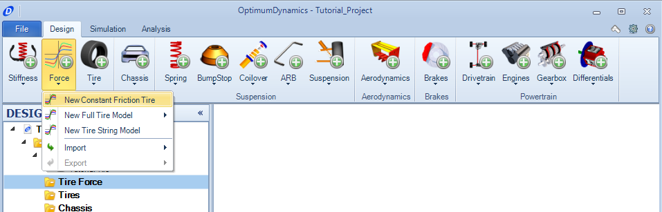
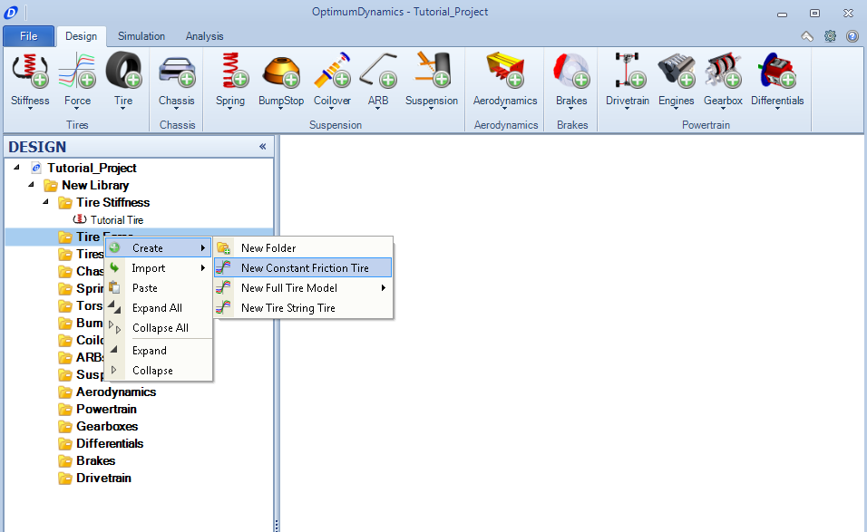
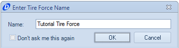
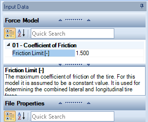

[Return to Start](1_Tutorial_1.md)

-|-|-|-
[Create Project](2_Create_Project.md)|[Tire Stiffness](3_Tire_Stiffness.md)|[Tire Friction](4_Tire_Friction.md)|[Tire Assembly](5_TireAssy.md)
[Chassis](6_Chassis.md)|[Spring](7_Spring.md)|[Bump Stop](8_BumpStop.md)|[Coilover](9_Coilover.md)
[Anti-Roll Bar](10_ARB.md)|[Linear Suspension](11_LinearSus.md)|[Aerodynamics](12_Aero.md)|[Brakes](13_Brakes.md)
[Differential](14_Diff.md)|[Drivetrain](15_DT.md)|[Powertrain](16_Powertrain.md)|[Gearbox](17_Gearbox.md)
[Introduction to Setup](18_Setupintro.md)|[Creating a Setup](19_Setup.md)|[Validating a Setup](20_ValidateSetup.md)|[Conclusion](21_Conclusion.md)

#Tire Friction

The tire friction is required for OptimumDynamics to solve for the actual forces at the tire contact patch.  To achieve this some form of a tire model is required.  The constant friction tire is the simplest type of tire model that OptimumDynamics offers.  Here is how the model can be used.

1) Since we are working left to right, the next button is the __Tire Force__ model. Click on the __New Constant Friction Tire__.

Alternatively, we can righ-click on the __Tire Force__ folder in the __Project Tree__.  A list of options will appear.  Click __Create__ to expand these choices further and select __New Constant Friction Tire__.  Note that this method can be used for any object.

2) Choose a name for the Tire Force Model and click __OK__.

3) Set the maximum value of the friction coefficient that the tire can create.  This is used in both the lateral and longitudinal directions.  Note that this assumes no slip capable by the tire.