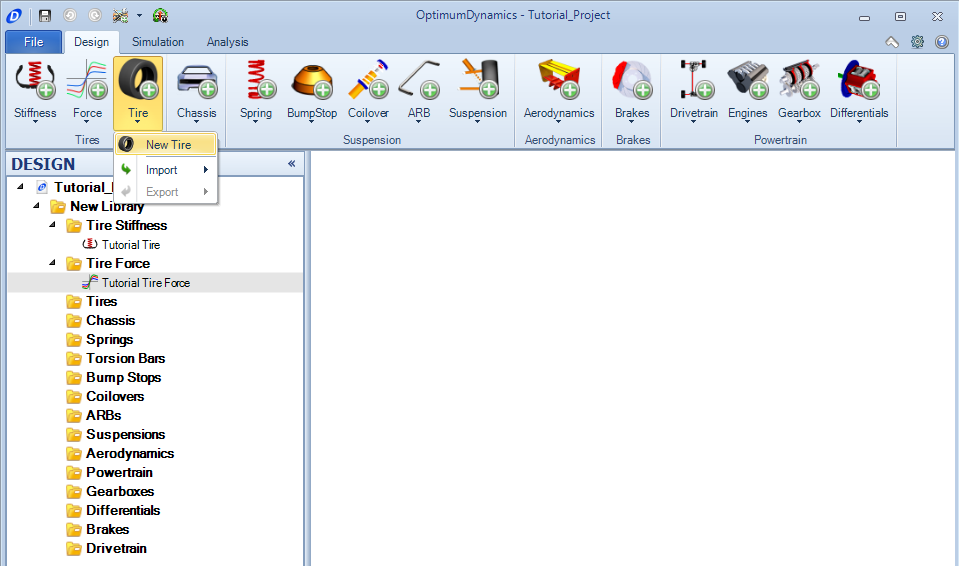
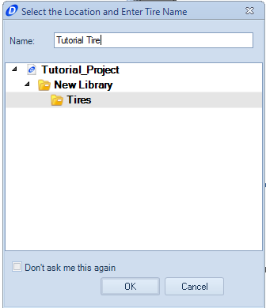
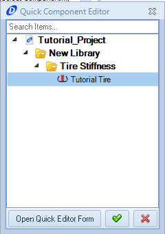
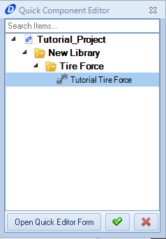
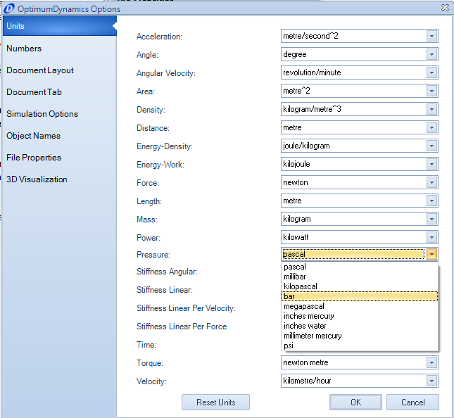

####[Return to Start](1_Tutorial_1.md)

1) [Create Project](2_Create_Project.md)|2) [Tire Stiffness](3_Tire_Stiffness.md)|3) [Tire Friction](4_Tire_Friction.md)|4) [Tire Assembly](5_TireAssy.md)
-|-|-|-
__5) [Chassis](6_Chassis.md)__|__6) [Spring](7_Spring.md)__|__7) [Bump Stop](8_BumpStop.md)__|__8) [Coilover](9_Coilover.md)__
__9) [Anti-Roll Bar](10_ARB.md)__|__10) [Linear Suspension](11_LinearSus.md)__|__11) [Aerodynamics](12_Aero.md)__|__12) [Brakes](13_Brakes.md)__
__13) [Differential](14_Diff.md)__|__14) [Drivetrain](15_DT.md)__|__15) [Powertrain](16_Powertrain.md)__|__16) [Gearbox](17_Gearbox.md)__
__17) [Introduction to Setup](18_Setupintro.md)__|__18) [Creating a Setup](19_Setup.md)__|__19) [Validating a Setup](20_ValidateSetup.md)__|__20) [Conclusion](21_Conclusion.md)__

#Tire Assembly

A tire assembly is comprised of a tire friction model and a tire stiffness model.  If one of the two components is missing from the model, the setup used will not validate.  

To create a tire assembly:

1) Click the __Add Tire__ button and select the __New Tire__ option

2) Provide the assembly a name and verify the location saved

3) Click the (...) next to *Select Component*

4) Select the created tire stiffness file.  The tire will now appear in the 3D Editor

5) Select the tire force model being used.  The tire pressure can be set after that.  

6) The tire assembly also specifies a tire pressure.  Our model does not include tire pressure effects, but should still be filled out.  This will be a good opportunity to go over the options changes.  The default units for pressures are Pascals, and we are going to switch them to bar.  To change the units:

Go to __options__ in the __Project Backstage__ or press the hot key __F9__.

Under __Units__, go to __Pressure__, and select Bar

7) With the units changed, set the pressure to 1.6 Bar.

8) Once the first tire is done, complete the same method for the second tire model, using the second tire model and a pressure of 1.65.

###[Next: Chassis](6_Chassis.md)
--------------------------------------------------------
###[Previous: Tire Friction](4_Tire_Friction.md)