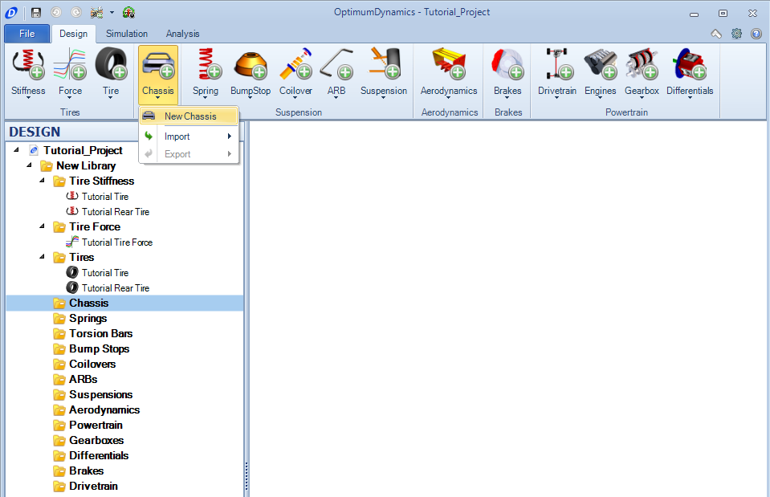
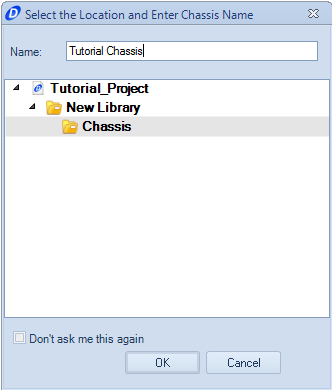
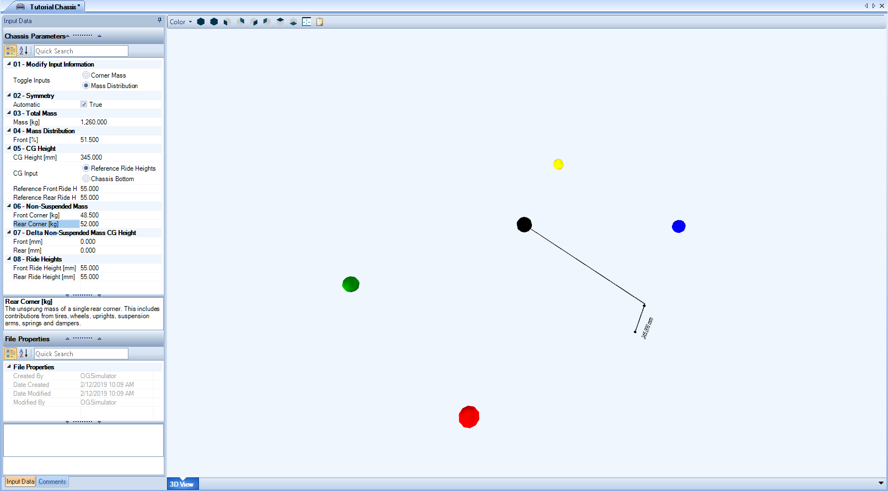

####[Return to Start](1_Tutorial_1.md)

1) [Create Project](2_Create_Project.md)|2) [Tire Stiffness](3_Tire_Stiffness.md)|3) [Tire Friction](4_Tire_Friction.md)|4) [Tire Assembly](5_TireAssy.md)
-|-|-|-
__5) [Chassis](6_Chassis.md)__|__6) [Spring](7_Spring.md)__|__7) [Bump Stop](8_BumpStop.md)__|__8) [Coilover](9_Coilover.md)__
__9) [Anti-Roll Bar](10_ARB.md)__|__10) [Linear Suspension](11_LinearSus.md)__|__11) [Aerodynamics](12_Aero.md)__|__12) [Brakes](13_Brakes.md)__
__13) [Differential](14_Diff.md)__|__14) [Drivetrain](15_DT.md)__|__15) [Powertrain](16_Powertrain.md)__|__16) [Gearbox](17_Gearbox.md)__
__17) [Introduction to Setup](18_Setupintro.md)__|__18) [Creating a Setup](19_Setup.md)__|__19) [Validating a Setup](20_ValidateSetup.md)__|__20) [Conclusion](21_Conclusion.md)__

#Chassis

The chassis component is used to define the mass distribution of the vehicle.  This sets the magnitude of weight transfer, the location of the center of gravity (where forces are applied) and the dynamics of the vehicle as it moves.  Either the distribution percentage or individual corner weight readings can be used to achieve this.  A value for the center of gravity is also required to fully define the vehicle.  To create the chassis:

1) Click the __Add Chassis__ button and select the __New Chassis__ option.

2) Provide a name for the chassis and click __OK__

3) The chassis parameters are now available on the left hand side of the document manager.

4) Input the parameters that can be seen within the image above.

Note where the center of gravity is measured from. There is an option to input the parameter at the vehicle reference ride height, then will convert the height for the actual vehicle ride height.

###[Next: Tire Stiffness](3_Tire_Stiffness.md)

###[Previous: Table of Contents](1_Tutorial_1.md)