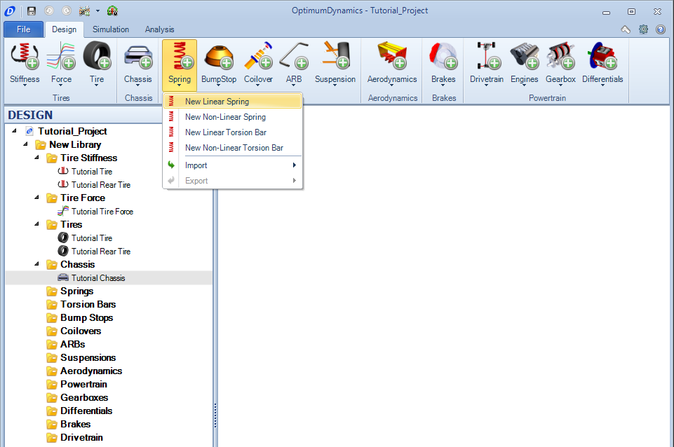
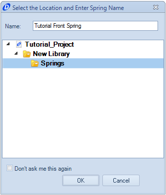
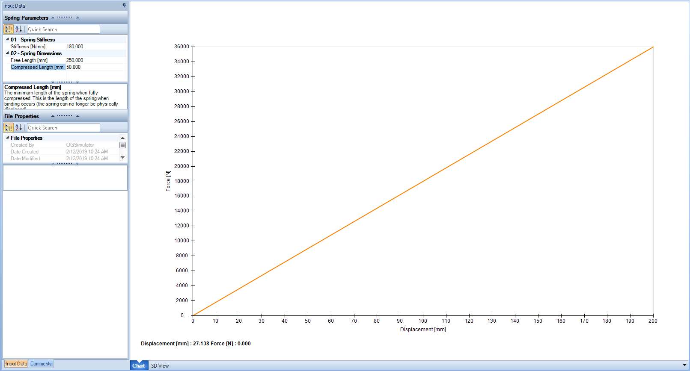
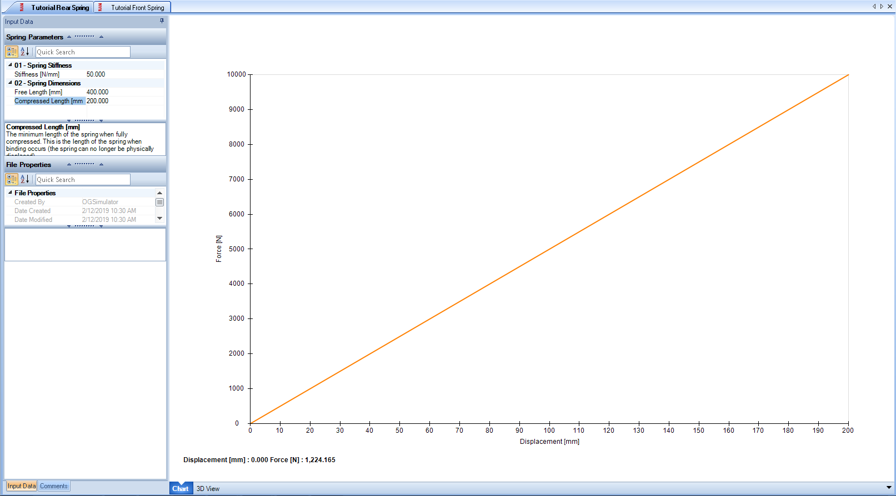

[Return to Start](1_Tutorial_1.md)

-|-|-|-
[Create Project](2_Create_Project.md)|[Tire Stiffness](3_Tire_Stiffness.md)|[Tire Friction](4_Tire_Friction.md)|[Tire Assembly](5_TireAssy.md)
[Chassis](6_Chassis.md)|[Spring](7_Spring.md)|[Bump Stop](8_BumpStop.md)|[Coilover](9_Coilover.md)
[Anti-Roll Bar](10_ARB.md)|[Linear Suspension](11_LinearSus.md)|[Aerodynamics](12_Aero.md)|[Brakes](13_Brakes.md)
[Differential](14_Diff.md)|[Drivetrain](15_DT.md)|[Powertrain](16_Powertrain.md)|[Gearbox](17_Gearbox.md)
[Introduction to Setup](18_Setupintro.md)|[Creating a Setup](19_Setup.md)|[Validating a Setup](20_ValidateSetup.md)|[Conclusion](21_Conclusion.md)

#Spring

The vehicle springing is necessary to allow the suspension to operate.  Some knowledge of this mechanism is required to determined how much, and in what way the suspension will move when inputs are applied in the simulation. To create the spring for the model:

1) Click on the __Add Spring__ button and select the __New Linear Spring__ option.

2) We will create the front spring first, so the names should correspond in a way that allows the user to recall the component quickly

3) The stiffness, free length, and compressed length can now be input.

Note that once the inputs for free length and stiffness are set, OptimumDynamics will start to calculate the force at each displacement of the spring to its fully compressed length.  This can be used as a secondary reference to verify that the spring stiffness input is correct.

4) Repeat the sequence now for the rear spring, with a stiffness of 50 N/mm