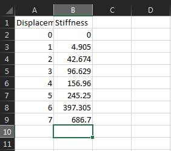
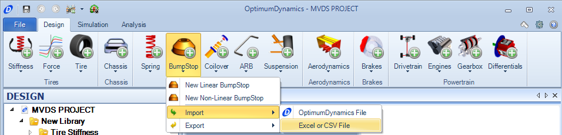
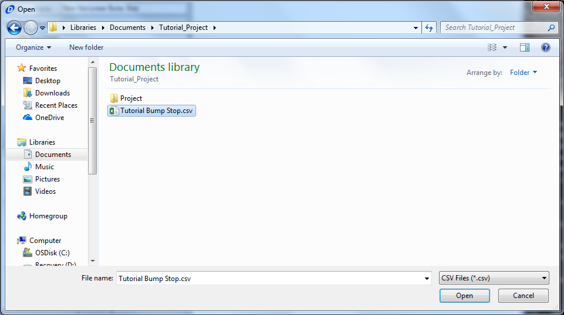
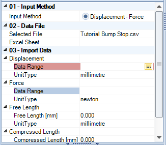
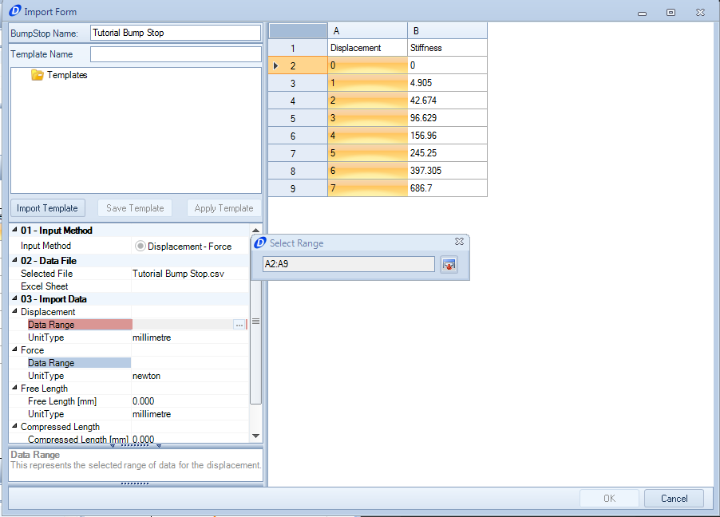
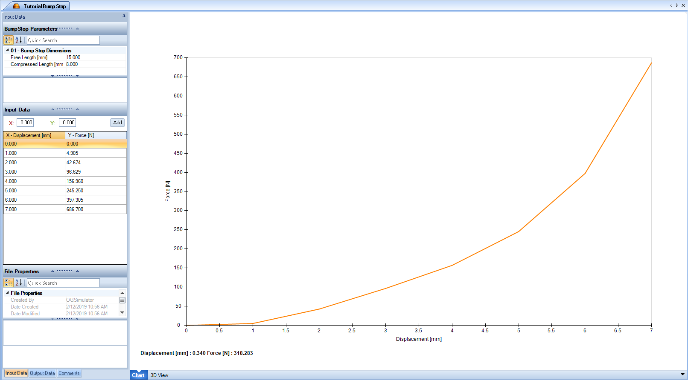

####[Return to Start](1_Tutorial_1.md)

1) [Create Project](2_Create_Project.md)|2) [Tire Stiffness](3_Tire_Stiffness.md)|3) [Tire Friction](4_Tire_Friction.md)|4) [Tire Assembly](5_TireAssy.md)
-|-|-|-
__5) [Chassis](6_Chassis.md)__|__6) [Spring](7_Spring.md)__|__7) [Bump Stop](8_BumpStop.md)__|__8) [Coilover](9_Coilover.md)__
__9) [Anti-Roll Bar](10_ARB.md)__|__10) [Linear Suspension](11_LinearSus.md)__|__11) [Aerodynamics](12_Aero.md)__|__12) [Brakes](13_Brakes.md)__
__13) [Differential](14_Diff.md)__|__14) [Drivetrain](15_DT.md)__|__15) [Powertrain](16_Powertrain.md)__|__16) [Gearbox](17_Gearbox.md)__
__17) [Introduction to Setup](18_Setupintro.md)__|__18) [Creating a Setup](19_Setup.md)__|__19) [Validating a Setup](20_ValidateSetup.md)__|__20) [Conclusion](21_Conclusion.md)__

#Bump Stop

Bump stops are a secondary spring usually intended to prevent the shock piston from bottoming out, causing damage to the vehicle.  They can also be used to control the ride height of a vehicle to much advantage.  To demonstrate how to create import data for a component, we are going to create a non-linear bump stop.

1) To start, open __Microsoft Excel (R)__ to a new worksheet

2) Input the following dimensions for displacement and force and save the file as __Tutorial Bump Stop.csv__.

3) Go to the __Bump Stop__ button and select the __Excel or CSV File__ option under __Import__.

4) Select the file name for the bump stop being used.

5) Click on the (...) to open up the series select tool.

6) Click on the column that corresponds to the displacement data. The data being used will be highlighted red.  Once selected, click on the button on the right hand side of the series select tool.

7) Repeat steps 5 and 6 for the force values.  The force data should be highlighted blue.

8) Input the compressed length.  Our bump stop will have a compressed length of 8mm

9) Input the extended length.  Our bump stop will have an extended length of 15mm

10) Click __OK__ to save the data import

10) The __Document Manager__ will display the data in the left hand editor column and a plot of the data

###[Next: Coilover](9_Coilover.md)
--------------------------------------------------------
###[Previous: Spring](7_Spring.md)