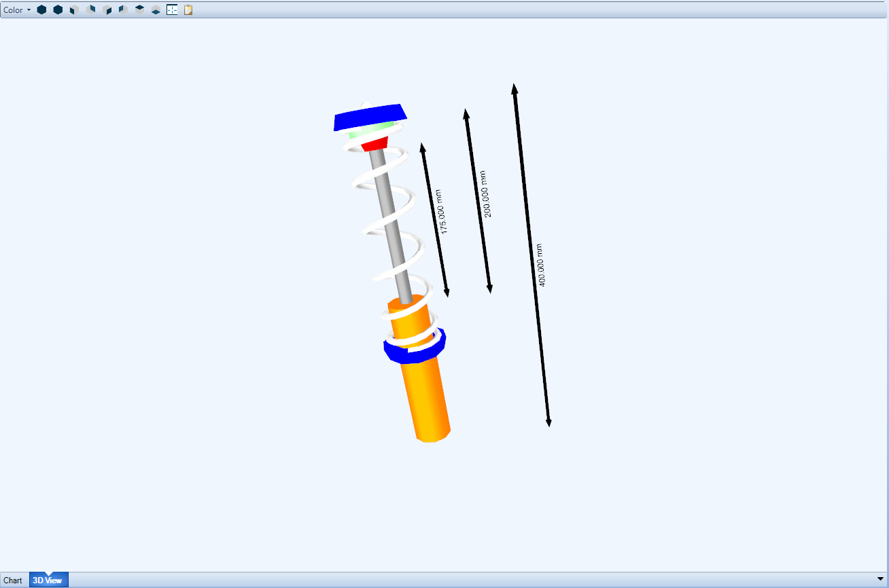

[Return to Start](1_Tutorial_1.md)

-|-|-|-
[Goals](../1_Goals.md)|[Tire Stiffness](../3_Tire_Stiffness.md)|[Tire Friction](../4_Tire_Friction.md)|[Tire Assembly](../5_TireAssy.md)
[Chassis](../6_Chassis.md)|[Spring](../7_Spring.md)|[Bump Stop](../8_BumpStop.md)|[Coilover](../9_Coilover.md)
[Anti-Roll Bar](../10_ARB.md)|[Linear Suspension](../11_LinearSus.md)|[Aerodynamics](../12_Aero.md)|[Brakes](../13_Brakes.md)
[Differential](../14_Diff.md)|[Drivetrain](../15_DT.md)|[Powertrain](../16_Powertrain.md)|[Gearbox](../17_Gearbox.md)
[Introduction to Setup](../18_Setupintro.md)|[Creating a Setup](../19_Setup.md)|[Validating a Setup](../20_ValidateSetup.md)|[Conclusion](../21_Conclusion.md)

#Coilover

The coilover is an assembly made up of the bump stop and the spring components connected to a spring damper assembly.  This can be used to set the spring preload or gap of the components used in the model.  Here are the options to create the coilover:

1) Click the __Add Coilover__ button and select the __New Coilover__ option.

2) The front and rear coilovers will be different, so we will need to create two components.  Name the first one the front coilover

3) Input the front spring previously created and add the bump stop to the assembly.  Set the extended and compressed length as listed above.  

Input a spring gap of 90mm and maximize the bump stop gap.  Note that both parameters are being measured at full droop.  OptimumDynamics will automatically set it to the maximum gap for the bump stop if the gap is greater than the travel of the coilover.

4) This time, rather than creating an all new component, we are going make a copy of the front coilover.  In the __Project Tree__, right click the front coilover and select __Copy__

5) The coilover can now be pasted to the library by highlighting the front coilover, right clicking, and selecting __Paste__.

6) __Rename__ the coilover copied to be the rear coilover

7) __Double Click__ the renamed file to open it in the __Document Manager__.

8) Change the spring component to the rear spring and adjust the spring gap 10mm tighter to 175mm

9) Notice that the plot in the __Document Manager__ now corresponds to the new spring rate and gap being used

The coilover assembly can also be observed as a 3D View by selecting the tab along the bottom of the __Document Manager__