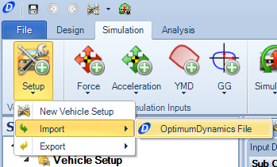
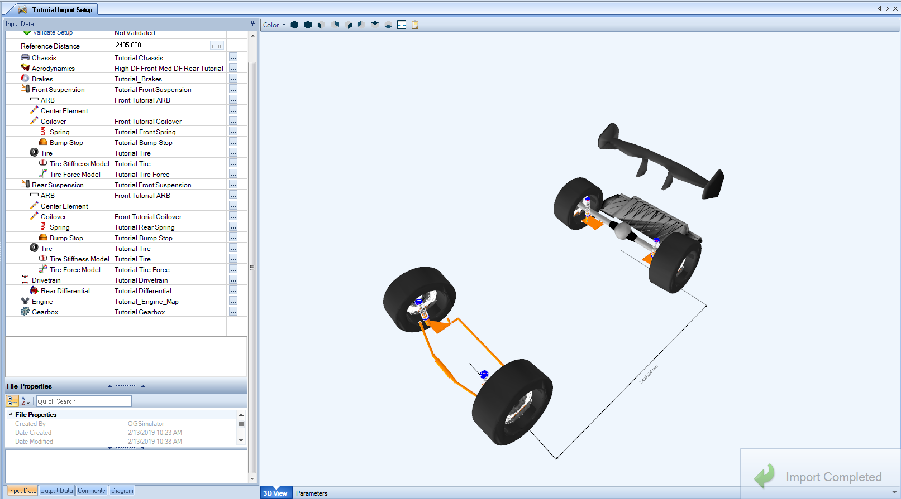
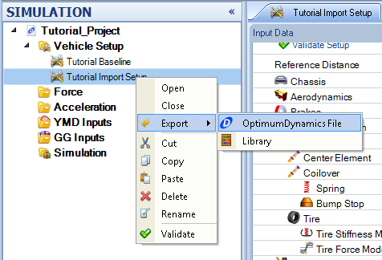
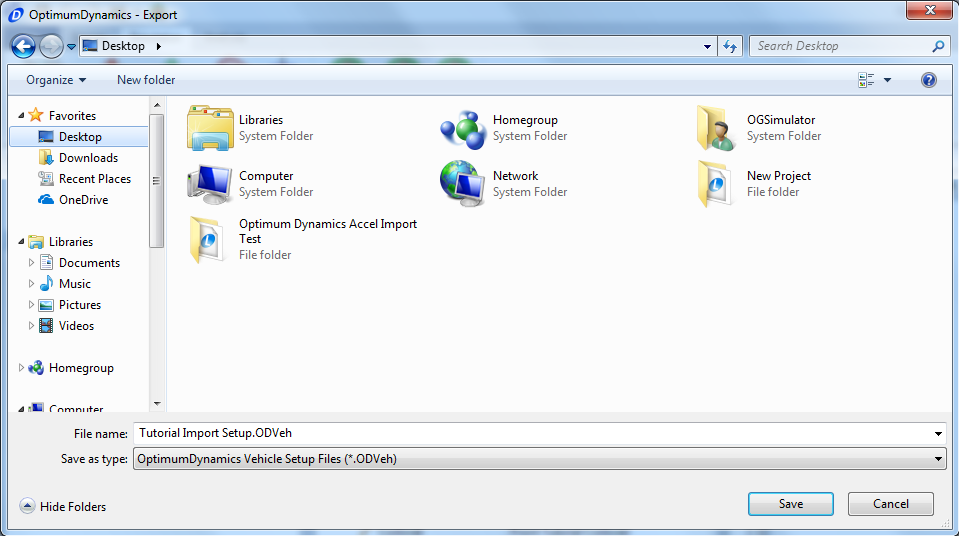

####__[Return to Home](1_Tutorial_2.md)__

[1) Importing and Exporting Setups](2_ImportExport.md)|[2) Single Step Simulation](3_SingleStepSim.md)|[3) Multiple Step Smooth Simulation](4_MultiStepSim.md)
-|-|-
[__4) Multiple Step Freehand Simulation__](5_MultiStepRough.md)|[__5) Track Replay Simulation__](6_TrackReplay.md)|[__6) Exporting Results Files__](7_ExportResults.md)
[__7) Yaw Moment Diagram Simulation__](8_YMDSim.md)|[__8) Conclusions__](9_Conclusions.md)

#Importing and Exporting Vehicle Setups

Right now there should be the baseline for our GT car in the setup folder in the __Project Tree__.  If that setup is not in the folder, it can be imported. We are also going to import a secondary setup to the system. The second setup can be downloaded __[here](../Tutorial Import Setup.ODVeh)__ The vehicle setup can be imported into OptimumDynamics using the following method. This can be very beneficial if working between multiple workspaces or working within a team to share and compare data.

This project should be a continuation of the one created in tutorial 1.  If you are not continuing the first tutorial, create a new project.  Details on how to do so can be found __[here](../Tutorial_1_Vehicle_Design/2_Create_Project.md)__

Here is the process to import the setup:

1) Download the __Setup__ above in the paragraph

2) Click on the __Setup__ botton and select the __Import OptimumDynamics File__ option available

3) Select the file from the downloaded location, when the setup is finished being imported, it should look like the image above.

4) Once the setup is imported, it needs to be validated in the project.  Click __Validate Setup__ to do so.

Exporting Setup

Exporting a setup is done in the same fashion as importing. This is an expecially good practice to affirm that the baseline setup does not get modified unintentionally. To export the setup:

1) The setup can be exported by right-clicking on the setup to export and select __Export->OptimumDynamicsFile__.

2) Save the file to a pertinant file location and select __Save__

3) Once the file is saved, the __Export Completed__ will show up in the bottom right hand corner of the window

###[Next: Creating a Single Force Simulation](3_SingleStepSim.md)
--------------------------------------------------------
###[Previous: Introduction](1_Tutorial_2.md)