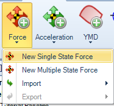
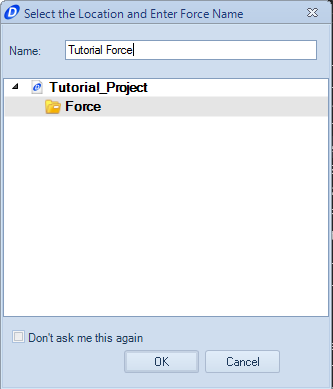
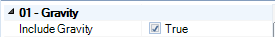
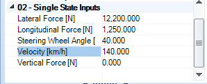
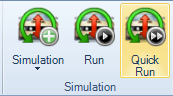
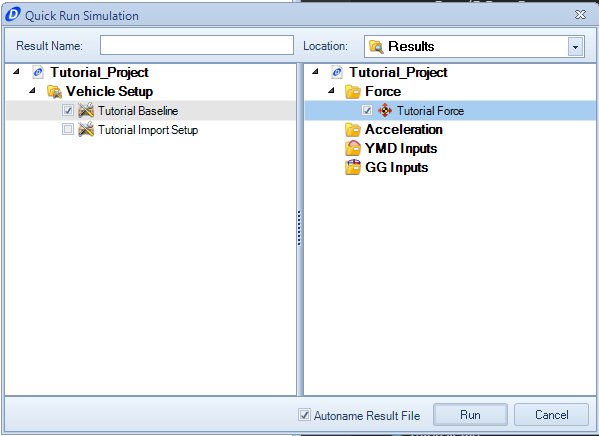
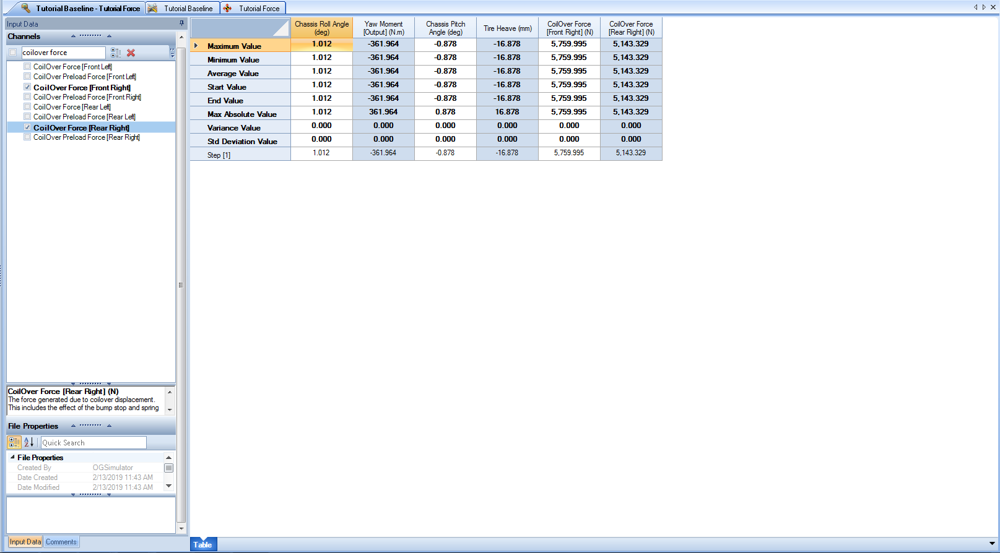

####__[Return to Home](1_Tutorial_2.md)__

[1) Importing and Exporting Setups](2_ImportExport.md)|[2) Single Step Simulation](3_SingleStepSim.md)|[3) Multiple Step Smooth Simulation](4_MultiStepSim.md)
-|-|-
[__4) Multiple Step Freehand Simulation__](5_MultiStepRough.md)|[__5) Track Replay Simulation__](6_TrackReplay.md)|[__6) Exporting Results Files__](7_ExportResults.md)
[__7) Yaw Moment Diagram Simulation__](8_YMDSim.md)|[__8) Conclusions__](9_Conclusions.md)

#Creating a Single Step Simulation

A single step simulation is an instance where a force or acceleration will be applied to the vehicle at the center of gravity as a lateral, longitudinal, and vertical composed vector.  Our simulation will use a single force application with components in lateral and the longitudinal directions.

Here is the process to create the simulation:

1) Click on the __Force__ button and select the __New Single State Force__.

2) Provide a name for the force that is being created.

3) By default, gravity is included in the simulation.  We are not using any aditional vertial loading, so we are going to leave that option on.

4) The simulation will be of a vehicle in a left hand turn. Thereforce, all of the inputs will be positive. Input the values for the simulation inputs as shown above.

5) To run the simulation, we will be using the __Quick Run__ function of OptimumDynamics. To do so, select the __Quick Run__ button

6) The quick run simulation, check the vehicle setup and the simulation input that want to be used for the simulation. The run button on the bottom of the window will only highlight when there is both a simulation input and a vehicle setup selected

7) Click on the __Run__ button to commence the simulation.

8) The file will have a name automatically generated based on the name of the setup and the name of the simulation.

9) Once the simulation is complete, the results file will appear in the __Document Manager__. Output results can be checked in the left hand column of the __Document Manager__ We will come back to this file in a little bit

###[Next: Creating a Smooth Multiple Step Simulation](4_MultiStepSim.md)
--------------------------------------------------------
###[Previous: Importing and Exporting a Setup](2_ImportExport.md)