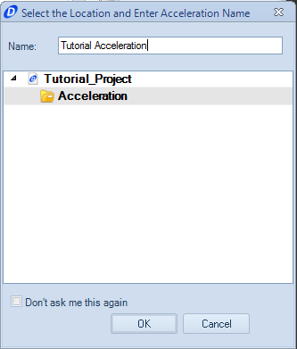
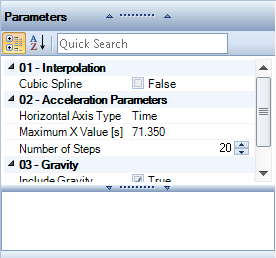
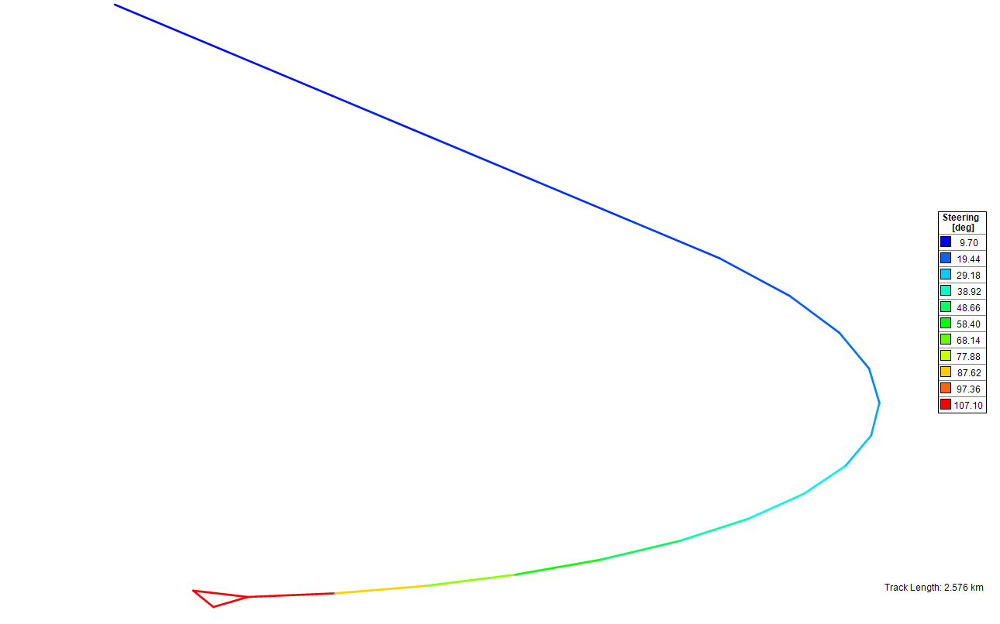
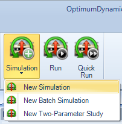
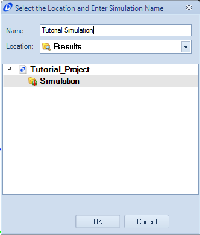
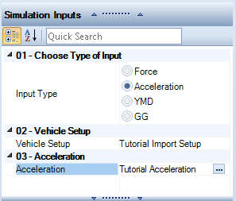
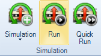
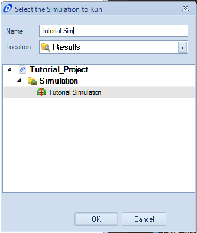

####__[Return to Home](1_Tutorial_2.md)__

[1) Importing and Exporting Setups](2_ImportExport.md)|[2) Single Step Simulation](3_SingleStepSim.md)|[3) Multiple Step Smooth Simulation](4_MultiStepSim.md)
-|-|-
[__4) Multiple Step Freehand Simulation__](5_MultiStepRough.md)|[__5) Track Replay Simulation__](6_TrackReplay.md)|[__6) Exporting Results Files__](7_ExportResults.md)
[__7) Yaw Moment Diagram Simulation__](8_YMDSim.md)|[__8) Conclusions__](9_Conclusions.md)

#Creating a Multiple Step Smooth Simulation

A multiple step simulation uses a sequence of inputs to create the reactions of the vehicle.  We are going to use an acceleration simulation to create our inputs, creating a continually increasing radius simulation.  Details of how to design the inputs are discussed in the case study __[here](../Case_Study_8_Creating_Course_Inputs/1_Case_8.md)__

Here are the steps to input and create the simulation:

1) Select the __New Multiple State Acceleration__ under the __Acceleration__ button.

2) Provide a name for the acceleration being used.

3) We will be using the time method to input the simulation parameters. To select time, under __Acceleration Parameters__, select the __time__ option under the dropdown menu.

4) The inputs for this simulation are going to be input using the x and y columns within OptimumDynamics. The table below has the inputs for each column.  When complete, the tables for each input should look like the ones above

Time|Lateral Accel.|Longitudinal Accel.|Vertical Accel.|Velocity|Steering Angle
-|-|-|-|-|-
0|1|0.2|0|60|107.1
5.097|1|0.2|0|70|78.8
10.194|1|0.2|0|80|60.4
15.291|1|0.2|0|90|47.7
20.387|1|0.2|0|100|38.7
25.484|1|0.2|0|110|32.0
30.581|1|0.2|0|120|26.8
35.678|1|0.2|0|130|22.9
40.775|1|0.2|0|140|19.7
45.872|1|0.2|0|150|17.2
50.968|1|0.2|0|160|15.1
56.065|1|0.2|0|170|13.4
61.162|1|0.2|0|180|11.9
66.259|1|0.2|0|190|10.7
71.356|1|0.2|0|200|9.7

5) We can also use the __Track Map__ function to check the inputs. To go to the __Track Map__ tab located on the bottom of the window. Your map should look similar to the one depicted above

6) We do have the option to use a __Cubic Spline__ to smooth the data of our inputs.  In our case, the data does not have any sharp peaks, so we do not need that function.  We will be using the __Cubic Spline__ in the next section

7) We also have the option to change the __Step Size__ of the simulation.  This can help increase or decrease the resolution of the simulation, especially if simulating a more complex course.  We will go over how to use the __Step Size__ in the next section.

Unlike the single state simulation, we are going to turn this simulation into a recurring configuration we want to run. To do this, we use the __Simulation__ tool.  Here are the steps to use it and run the simulation.

1) Click on the __New Simulation__ option within the __Simulation__ button

2) Provide a name for the simulation

3) For this simulation, we are going to use the imported vehicle setup and the acceleration input we just created.  These can be accessed by clicking in the "select component" section of the input window.

4) The simulation is run by clicking the run button in the command ribbon

5) Name the simulation run that is being completed. This name will be carried over with the results file. Click __OK__ and the simulation will run.

###[Next: Creating a Freehand Multiple Step Simulation](5_MultiStepRough.md)
--------------------------------------------------------
###[Previous: Creating a Single Force Simulation](3_SingleStepSim.md)