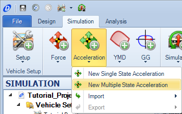
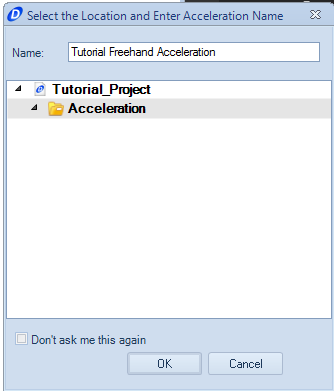
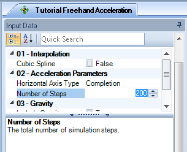
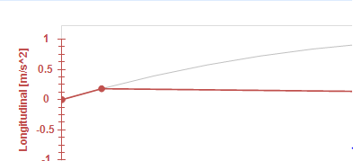
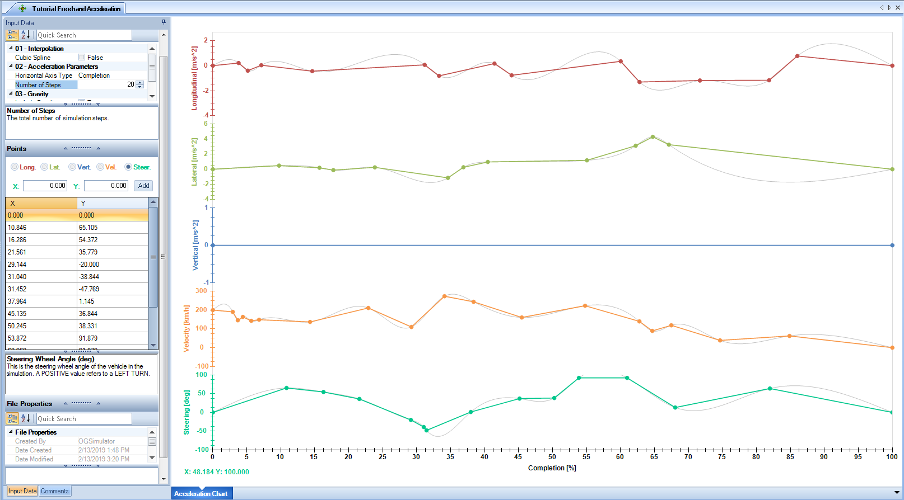
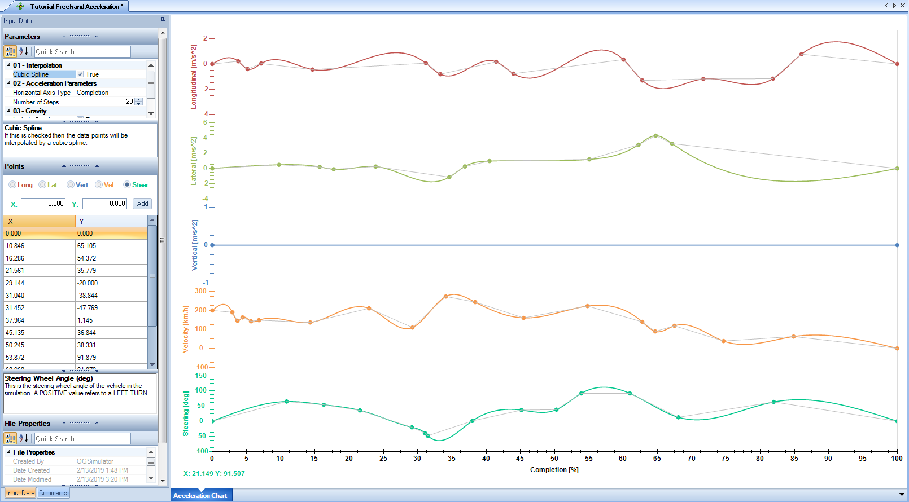

####__[Return to Home](1_Tutorial_2.md)__

[1) Importing and Exporting Setups](2_ImportExport.md)|[2) Single Step Simulation](3_SingleStepSim.md)|[3) Multiple Step Smooth Simulation](4_MultiStepSim.md)
-|-|-
[__4) Multiple Step Freehand Simulation__](5_MultiStepRough.md)|[__5) Track Replay Simulation__](6_TrackReplay.md)|[__6) Exporting Results Files__](7_ExportResults.md)
[__7) Yaw Moment Diagram Simulation__](8_YMDSim.md)|[__8) Conclusions__](9_Conclusions.md)

#Creating a Freehand Multi-Step Simulation

Inputs in the multiple state simulation can also be input freehand onto the plot itself. This section will explain how to turn those rough inputs into a more realistic simulation input.  Note that the simulation inputs will not perfectly match the inputs shown here.

Here are the steps to create this simulation:

1) Select the __New Multiple State Acceleration__ option in the __Acceleration__ button

2) Input a name for the simulation

3) This section will be a completion simulation. Make sure that the __Horizontal Axis Type__ is set to __Completion__

4) We will also be using a higher resolution for this simulation. Increase the __Step Size__ of the simulation from 20 to 200

<video width="640" height="480" autoplay>
  <source src="/img/scroll_tool.mp4" type="video/mp4">
Your browser does not support the video tag.
</video>

4) In the __Longitudinal Acceleration__, we want to zoom in the y-axis click in comparable positions to create the longitudinal acceleration inputs. Use the scroll tool on the mouse to zoom in on the plot. The video above shows how the axis will shift.

5) Plot the data points along the axis to create the acceleration profile. __Click__ on the plot area to add a data point for the input.

6) Continue adding data points for the lateral and longitudinal accelerations along with the velocity and steering inputs. The final plot should look like above.

7) Notice the grey overlay that is now appearing on the plot. This is the cubic spline plot. We can select to use the more smoothed out cubic spline plot by clicking the __Cubic Spline__ button in the top left corner of the __Document Manager__

The plot will now look like this:

8) The simulation can now be run using either the __Quick Run__ methods or the __Simulation__ function method. Use the __Tutorial Import Setup__ for this simulation.

###[Next: Making a Track Replay Simulation](6_TrackReplay.md)
--------------------------------------------------------
###[Previous: Creating a Smooth Multiple Step Simulation](4_MultiStepSim.md)