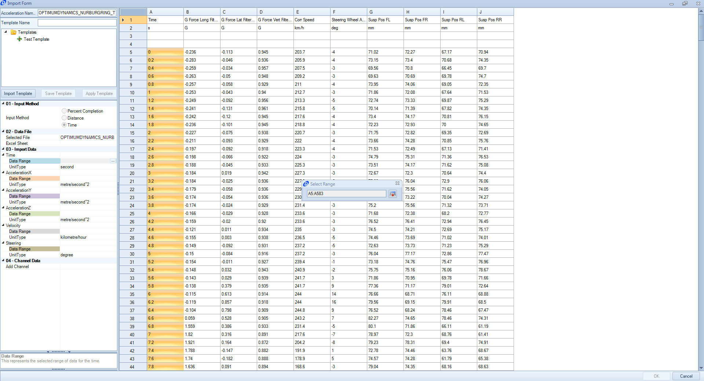

####__[Return to Home](1_Tutorial_2.md)__

[1) Importing and Exporting Setups](2_ImportExport.md)|[2) Single Step Simulation](3_SingleStepSim.md)|[3) Multiple Step Smooth Simulation](4_MultiStepSim.md)
-|-|-
[__4) Multiple Step Freehand Simulation__](5_MultiStepRough.md)|[__5) Track Replay Simulation__](6_TrackReplay.md)|[__6) Exporting Results Files__](7_ExportResults.md)
[__7) Yaw Moment Diagram Simulation__](8_YMDSim.md)|[__8) Conclusions__](9_Conclusions.md)

#Creating a Track Replay Data Simulation

A track replay uses logged data to create the inputs for the acceleration, velocity, and steering data of a vehicle simulation. We have provided a data file that can be used for this __[here](../OPTIMUMDYNAMICS_NURBURGRING_TUTORIAL.csv)__

First we are going to need to import the data.  Here are the steps to do so:

1) Go into the __Import__ option under the __Acceleration__ button and select the __Excel or CSV File__ option.

2) Import the file that you just downloaded using the file explorer. The import tool user interface will now come up.

3) We are going to make a template for the data. First, we need to select the data being used. We will start by selecting the time data as shown above

4) Our acceleration data is given in g's. Therefore, we need to change the units from m/s^2 to g's. We can do so as shown above

5) We can now select the acceleration data. When complete, the lateral, longitudinal, and vertical accelerations should match the columns listed above. Select the data by clicking on the column heading above the data set.

6) Select the data for the velocity and steering angle using the same method as above.

7) You will notice we also have four columns of data from linear potentiometers.  We are going to add a channel for this data to use it in the simulation. To start, select the highlighted button above to add the channel.

8) Name the channel as shown above and set the units to length.

9) Select the data column that corresponds to the created data channel

10) Repeat steps 7-9 for the other three channels. When completed, the data results should look like the image above

11) To create the template for the acceleration data, we now want to type a name for the template in the top left corner input (shown above).

12) Select the save template button

13) The above prompt will now come up. If yes is selected, the software will automatically adjust the number of rows in the template to match the native row length.

14) We can now click __OK__ to create the acceleration file

Since this is a closed course, we can select the  button to close the track

16) To rotate the map, we can do so using the button on the top length of the __Document Manager__. The results show in the image below

17) The last thing to do is to run the simulation. We are going to use the __Quick Run__ tool and the imported setup

###[Next: Exporting Results Files](7_ExportResults.md)
--------------------------------------------------------
###[Previous: Creating a Freehand Multiple Step Simulation](5_MultiStepRough.md)