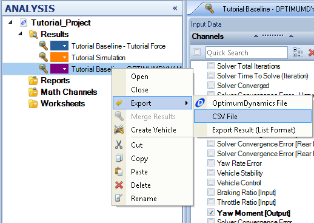

####__[Return to Home](1_Tutorial_2.md)__

[1) Importing and Exporting Setups](2_ImportExport.md)|[2) Single Step Simulation](3_SingleStepSim.md)|[3) Multiple Step Smooth Simulation](4_MultiStepSim.md)
-|-|-
[__4) Multiple Step Freehand Simulation__](5_MultiStepRough.md)|[__5) Track Replay Simulation__](6_TrackReplay.md)|[__6) Exporting Results Files__](7_ExportResults.md)
[__7) Yaw Moment Diagram Simulation__](8_YMDSim.md)|[__8) Conclusions__](9_Conclusions.md)

#Exporting Simulation Results

Results files are automatically generated by the software and will appear after a simulation has been run. The files can then be exported to either another OptimumDynamics file, a CSV file, or an Excel file. The results can then have post processing completed in other file formats.

To export the results file as a CSV format:

1) Right click on the data file that is desired to be exported, go to __Export->CSV File__

2) The file location can then be specified and the data used in any other file format. The process can be used for any other file format.

__Note:__ OptimumDynamics can only import an OptimumDynamics Native File

###[Next: Creating a Yaw Moment Diagram](8_YMDSim.md)
--------------------------------------------------------
###[Previous: Making a Track Replay Simulation](6_TrackReplay.md)