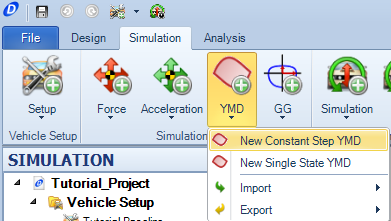
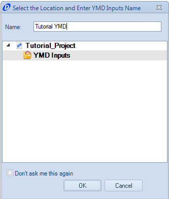
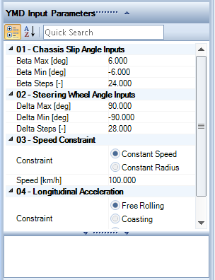

####__[Return to Home](1_Tutorial_2.md)__

[1) Importing and Exporting Setups](2_ImportExport.md)|[2) Single Step Simulation](3_SingleStepSim.md)|[3) Multiple Step Smooth Simulation](4_MultiStepSim.md)
-|-|-
[__4) Multiple Step Freehand Simulation__](5_MultiStepRough.md)|[__5) Track Replay Simulation__](6_TrackReplay.md)|[__6) Exporting Results Files__](7_ExportResults.md)
[__7) Yaw Moment Diagram Simulation__](8_YMDSim.md)|[__8) Conclusions__](9_Conclusions.md)

#Creating a Yaw Moment Diagram Simulation

The __Yaw Moment Diagram__ is a tool that can be used to understand the limit nature of the vehicle. We can create the full Yaw Moment Diagram using the __Constant Step__ tool and set the parameters to determine the size. The Yaw Moment Diagram does require a full tire model to use.

While the model we created cannot be used for this simulation, here are the steps to do so:

1) Select the __Constant Step YMD__ option under the __YMD__ button

2) Provide a name for the Yaw Moment Diagram being created

3) OptimumDynamics comes pre-loaded with parameters to create the Yaw Moment Diagram. The only parameter we are going to change is the __Free Rolling__ setting to the __Fixed Acceleration__ setting.  We will set this to -7.48 m/s^2

4) Run the simulation using the __Quick Run__ tool.

#[Next: Conclusion](9_Conclusions.md)
--------------------------------------------------------
#[Previous: Exporting Results Files](7_ExportResults.md)