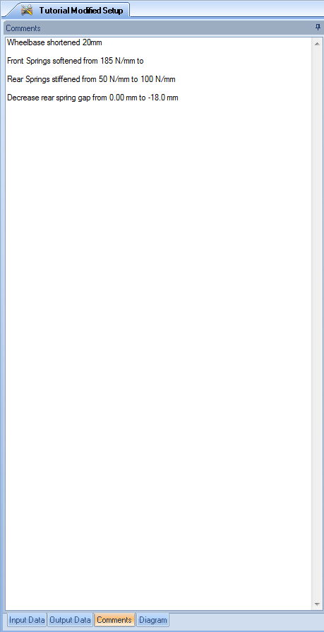

####[Return to Start](1_Tutorial_4.md)

1) [Setup Organization](2_VehicleOrg.md)|2) [Setup Changes](3_SetupChange.md)|3) [2-Parameter Study](4_2Param.md)|4) [Batch Simulation](5_BatchSim.md)
-|-|-|-
__5) [Results Organization](6_ResultsOrg.md)__|__6) [Exporting Setup Changes](7_ExportChange.md)__|__7) [Conclusions](8_Conclusions.md)__

#Organizing Vehicle Setups

At this time, there should be only two setups in the __Vehicle Setup__ library if following along through all the tutorials or one vehicle setup in the __Vehicle Setup__ library if you are starting from this point.  There should also be an acceleration file for the Nurburgring GP circuit in the __Acceleration__ library.

We are going to create a second copy of the baseline setup that we will use for modification. We are also going to create a folder for the modified setup. Here are the steps that we will follow in doing so:

1) Right click on the __Vehicle Setup__ library. Select the __Create->New Folder__ option as shown above

2) Provide a name for the folder. We are going to call the folder __Front Setup Changes__ as shown above.

3) We will now copy the baseline setup.  Right click on the setup and select __Copy__.

4) Select the created folder and __Right Click->Paste__. __Rename__ the copied setup 

5) Make sure that the baseline setup is closed, then __Open__ the copied vehicle setup.

6) We will use the __comment__ tool along the bottom of the __Document Manager__ to explain what is being done with this setup.  Copy down the comments shown above. We will make the setup changes in the next step.

###[Next: Making Setup Changes](3_SetupChange.md)
---
###[Previous: Introduction](1_Tutorial_4.md)