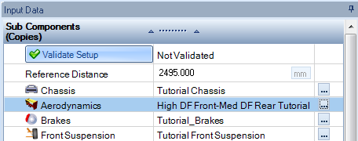
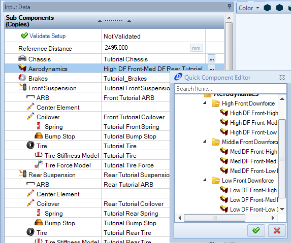
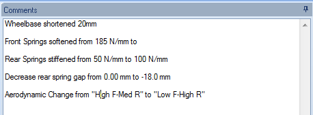
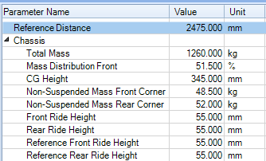
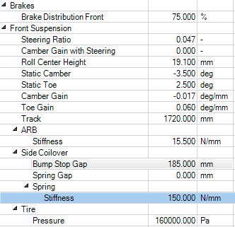
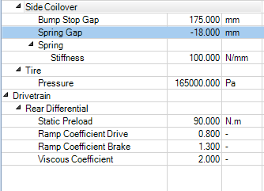

####[Return to Start](1_Tutorial_4.md)

1) [Setup Organization](2_VehicleOrg.md)|2) [Setup Changes](3_SetupChange.md)|3) [2-Parameter Study](4_2Param.md)|4) [Batch Simulation](5_BatchSim.md)
-|-|-|-
__5) [Results Organization](6_ResultsOrg.md)__|__6) [Exporting Setup Changes](7_ExportChange.md)__|__7) [Conclusions](8_Conclusions.md)__

#Making Setup Changes

Setup changes can either be made by swapping vehicle components or by modifying the vehicle parameters. We will complete both in this section and then put this setup into simulation.

Here are the steps to make the changes to the setup using the component method:

1) In the __Input Parameters__ tab, click on the  button within the aerodynamics parameter.

2) Select the __Low Downforce Front-High Downforce Rear__ option created in the design section. If you do not have that configuration, it can be created based on the parameters listed __[here](../Tutorial_1_Vehicle_Design/12_Aero.md)__

3) Add the setup change to the __comments__ section as shown above.

We are now going to modify some of the vehicle parameters using the setup editor. To do so:

<video width="800" height="480" autoplay>
  <source src="/img/change_gearbox.mp4" type="video/mp4">
Your browser does not support the video tag.
</video>

1) __Double Click__ on the __Gearbox__ option. Notice that the __component editor__ now comes up in the area where the 3D view was.

2) Change the final drive of the gearbox from __2.17__ to __2.34__.

3) __Close__ the gearbox option as shown in the video above

4) __Comment__ the gearbox change into the file

Lastly we are going to use the parameter tools. 

1) Select the __Parameters__ tab to show an Excel style setup sheet in the __Document Magager__ as depicted above

2) __Double Click__ the reference distance at the top of the page and type in the value 2475mm. This will shorten the wheelbase by 20mm as described in the previous step

3) Select the fron spring stiffness as highlighted above. Type in a value of __150N/mm__

4) Repeat step 3 for the rear springs (stiffen them to 100N/mm)

5) Change the spring gap from __0.00mm__ to __-18mm__

6) __Save__ the vehicle setup and perform a __Quick Run__ simulation using the __Track Replay__ acceleration inputs

###[Next: Creating a Two-Parameter Study](4_2Param.md)
---
###[Previous: Setup Organziation](2_VehicleOrg.md)