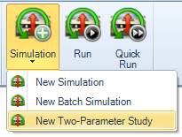
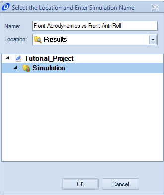
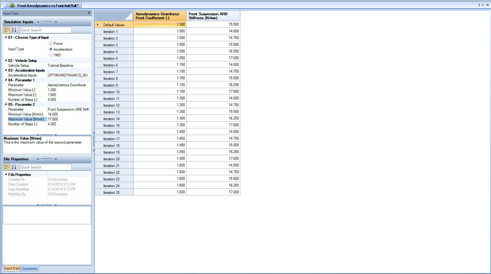
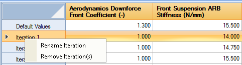
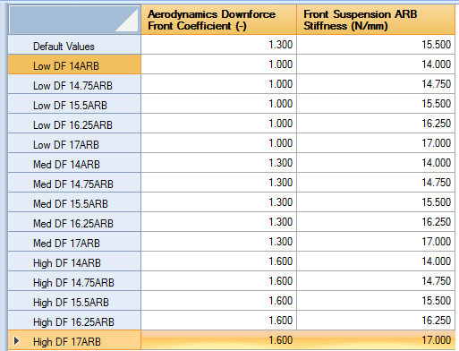
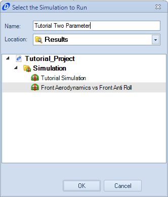

####[Return to Start](1_Tutorial_4.md)

1) [Setup Organization](2_VehicleOrg.md)|2) [Setup Changes](3_SetupChange.md)|3) [2-Parameter Study](4_2Param.md)|4) [Batch Simulation](5_BatchSim.md)
-|-|-|-
__5) [Results Organization](6_ResultsOrg.md)__|__6) [Exporting Setup Changes](7_ExportChange.md)__|__7) [Conclusions](8_Conclusions.md)__

#Creating a Two-Parameter Study

The two-parameter study is a method that analyzes a two different parameters across a range of values with a goal of finding the relationship between the two values. We will create a study analyzing the relationship between the front anti-roll bar and the front downforce coefficient.

To create the study:

1) Under __Simulation__, select the __Two-Parameter Study__ option 

2) Name the study __Front Aerodynamics vs Front Anti Roll__ 

3) Input the vehicle setup (using the vehicle baseline setup) and the acceleration inputs for the vehicle in the left hand column of the __Document Manager__

4) Set the first parameter to be __Front Aerodynamic Downforce__. The minimal value will be __1.0__, the maximum wil be __1.6__, and the number of steps will be __2__ to match the configuration options of the design

5) The second parameter will be set to be the __Front Suspension ARB Stiffness__. The minimum value will be set to __14N/mm__ and the maximum will be __17N/mm__. The step size will be set to __4__. Once complete, the results table should be the same as above

6) We are going to name the iterations in the file. __Right Click__ on the first iteration and select __Rename Iteration__

7) Continue to rename all of the iterations until the full table is filled out as shown above

8) Use the __Run__ button to start the simulation

9) __Highlight__ the simulation that we will be running by __Left Clicking__ on the simulation. __Name__ the file as shown above. Then click __OK__.

###[Next: Creating a Batch Simulation](5_BatchSim.md)
---
###[Previous: Making Setup Changes](3_SetupChange.md)