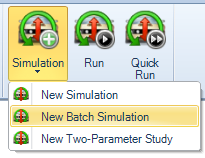
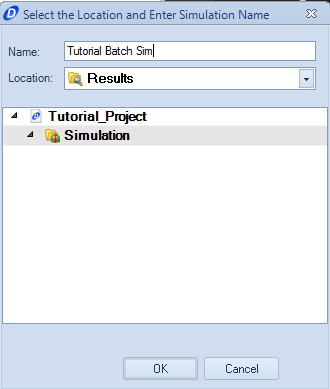
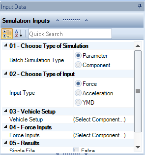
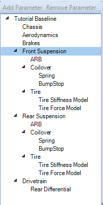
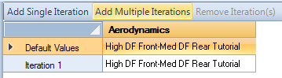
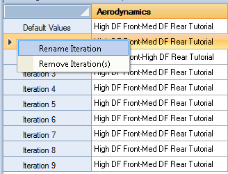
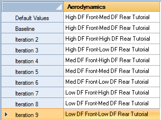
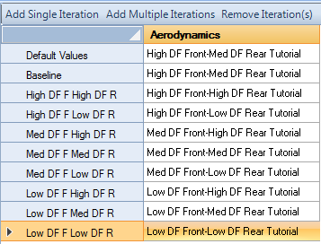
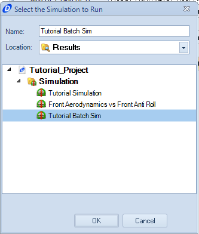

####[Return to Start](1_Tutorial_4.md)

1) [Setup Organization](2_VehicleOrg.md)|2) [Setup Changes](3_SetupChange.md)|3) [2-Parameter Study](4_2Param.md)|4) [Batch Simulation](5_BatchSim.md)
-|-|-|-
__5) [Results Organization](6_ResultsOrg.md)__|__6) [Exporting Setup Changes](7_ExportChange.md)__|__7) [Conclusions](8_Conclusions.md)__

#Creating a Batch Simulation

The batch simulation is a method of comparing multiple component inputs on the same result.  To create a batch simulation, we will perform a component simulation of the aerodynamics package.

To create the batch simulation:

1) Select the __Batch Simulation__ option under the __Simulation__ button to create the simulation.

2) Provide a name for the batch simulation

3) Set the type of Simulation to __Component__ and the vehicle setup to the __Baseline__ setup.

4) Set the input type to be the __Acceleration__ input. Set the input to be the __track replay__

5) We want to create multiple files from this simulation. Therefore, do __NOT__ check the single file option

6) We now have a list of options that are available to be modified within the batch simulation. __Highlight__ and __Double Click__ the __Aerodynamics__ option to add the aerodynamics component as an option to modify.

7) Select the __Add Multiple Iterations__ option to increase the number of options that are available to run. Add __8__ more iterations.

8) Rename the first iteration to __Baseline__. We will do the same thing for the rest as we modify them

9) Set the parameters for the rest of the iterations being run. The table should have each of the parameters available above. If you do not have all of the components, we go over what the parameters are __[here](../Tutorial_1_Vehicle_design/12_Aero.md)__

10) __Rename__ the iterations to a corresponding name as above. OptimumDynamics uses the name of the iteration to differentiate the results, so it can be very easy to lose the changes if not properly named.

11) We can now __Run__ the simulation using the __Run__ button

12) Provide a name for the simulation. __Highlight__ the simulation being run, then click __OK__.

###[Next: Organizing the Simulation Results](6_ResultsOrg.md)
---
###[Previous: Creating a Two-Parameter Study](4_2Param.md)