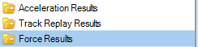
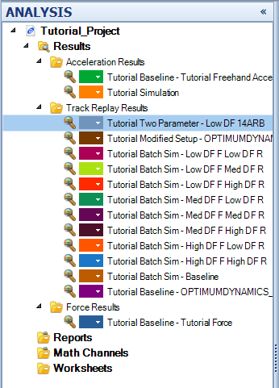
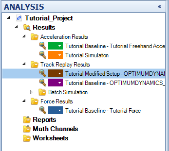
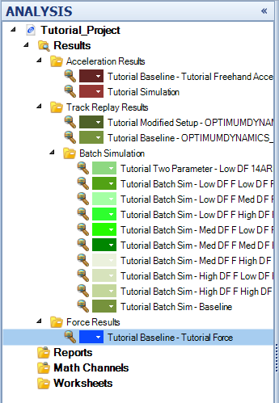

####[Return to Start](1_Tutorial_4.md)

1) [Setup Organization](2_VehicleOrg.md)|2) [Setup Changes](3_SetupChange.md)|3) [2-Parameter Study](4_2Param.md)|4) [Batch Simulation](5_BatchSim.md)
-|-|-|-
__5) [Results Organization](6_ResultsOrg.md)__|__6) [Exporting Setup Changes](7_ExportChange.md)__|__7) [Conclusions](8_Conclusions.md)__

#Organizing the Simulation Results

At this point, there are a significant number of simulation results that have been created in the __Analysis__ tool. We are now going to organinze the results.

Here is the process we are going to take:

1) Check that you have all of the simulations from this tutorial and the the previous tutorial (if using the same file). There should be 15 simulation results created in the __Results__ folder if every simulation has been run.

2) Create __three__ folders for the __Results__ library. __Right Click__ on the __Results__ library and select __Create->New Folder__.

3) The three new folders should be as shown above. We are going to organize our results by the type of input used

4) Left Click on a Simulation result and drag the simulation result to the corresponding simulation. A black bar will show up below the folder where the result will be moved to.

5) Create one more folder within the __Track Replay__ folder to organize the __Batch Simulation__ results and the rest of the simulations. Use the same steps so that the folders look like the above image.

You will notice that we also have the colors available to work with on the left hand side in the __Project Tree__. We are also going to use those to organize things.

Here is how we are going to use the colors:

1) We will use a common color range for the three input folders.  Use __blue__ for the forces, __red__ for the acceleration, and __green__ for the track replays.

2) __Gradient__ each of the colors for the simulations. Once we have everything organized, we can __save__ the project

#[Next: Exporting and Saving Setup Changes](7_ExportChange.md)
---
#[Previous: Creating a Batch Simulation](5_BatchSim.md)