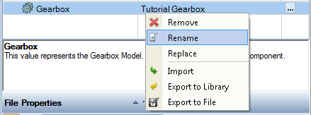
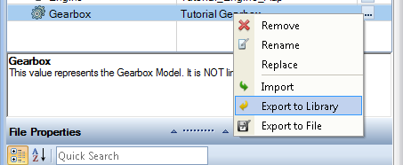
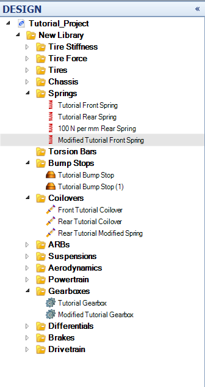

####[Return to Start](1_Tutorial_4.md)

1) [Setup Organization](2_VehicleOrg.md)|2) [Setup Changes](3_SetupChange.md)|3) [2-Parameter Study](4_2Param.md)|4) [Batch Simulation](5_BatchSim.md)
-|-|-|-
__5) [Results Organization](6_ResultsOrg.md)__|__6) [Exporting Setup Changes](7_ExportChange.md)__|__7) [Conclusions](8_Conclusions.md)__

#Exporting and Saving Setup Changes

While we have made the setup changes in OptimumDynamics, the components modified have __Not__ been stored in the __Component Library__. We have a few different options available to create components from the modified setup.

We will start by exporting directly from the setup user interface in the __Document Manager__. To do so:

1) __Right Click__ on the simulation input that is going to be exported.

2) Select __Rename__ to rename the modified component so that the library has both options.

3) __Right Click__ again then select __Export to Library__ option as shown above

4) __Repeat__ this step for the __Rear Coilover__, the __Rear Spring__, and the __Front Spring__.

5) We can now go to the __Design__ tab and see the components that we exported.

#[Next: Conclusions](8_Conclusions.md)
---
#[Previous: Organizing the Simulation Results](6_ResultsOrg.md)