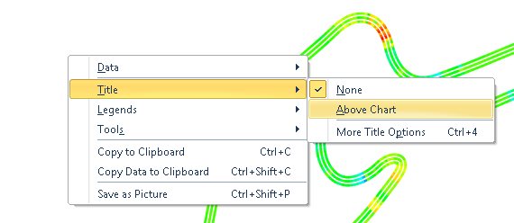

####[Return to Start](1_Tutorial_3.md)

1) [Importing Results](2_Importing_Results.md)|2) [Create a Worksheet](3_Create_Worksheet.md)|3) [Create Table](4_CreateTable.md)|4) [Create 2D Plot](5_2DChart.md)
-|-|-|-
__5) [Create Contour Chart](6_ContourChart.md)__|__6) [Comparison Plot](7_CompPlot.md)__|__7) [Create YMD Plot](8_YMDPlot.md)__|__8) [Create Track Map](9_TrackMap.md)__
__9) [Reporting Simulation Data](10_SimReport.md)__|__10) [Conclusions](11_Conclusion.md)__

#Creating a Simulation Report

Now that the results from the simulation have been plotted, curve fit, compared, and mapped, we can now export the results files for reporting. Before we do, we are going to add some final pieces of content to describe the created plots.

First we are going to add titles to the plots. Starting with the __Track Map__ created within in the __Worksheet__:

1) Add the title by __Right Clicking__, __Highlight__ the __Title__ option, and then select __Above Chart__.

2) A generic title now appears above the map. Since we do not have much information from just the single output, we are going to want to chnage it.

3) __Right Click__ on the white space again and go to __Title -> More Title Options__

4) The __Label Editor__ now appears. __Type__ a title that corresponds to the results that you have created. __Increase__ the font size used and then __bold__ the title.

5) The title should now look similar to the one above. Repeat steps 1-4 for the __2D Plots__ within the __Worksheet__.

6) We can now save the plot as an image. Before we do so, select the __Maximize__ in the top right hand corner.

7) __Right Click__ on the white space of the plot and select __Save as Picture__.

8) Provide a file location and a name for the file. Then click __OK__.

9) __Click__ on the __Maximize__ button again and the image will return to the original size.

10) Change the title on the remaining 2D plots. 

For the 2D Plots and the YMD Plot, we are going to make some additional changes. To start, we will turn on the __gridlines__

1) To turn on the __gridlines__, go to the __Primary Horizontal Axis -> Gridlines -> Major__. This will turn on the gridlines at each tick mark on the horizontal axis.

2) Repeat this step for the vertical axis. The final result should look like above. Once complete, repeat the two steps on the remaining plots. They should end up looking like the plots below.

3) We can now export the three plots using the same process as used for the __track map__.

Lastly we are going to export the data from the tables to an Excel plot. To do so:

1) Maximize the Table

2) __Click__ on the  button in the top left hand corner of the table

3) __Scroll__ to any white space within the table and __Right Click__ on the space. Select __Copy Data to Clipboard__.

4) Open an new Excel file and __Right Click -> Paste__. The data will now show up as a divided text format. The results can now be analyzed using the tools available in Excel or be presented in a formatted table.

5) Repeat the same steps with the __Setup Table__ to create a setup sheet template for the vehicle.

#[Next: Conclusions](11_Conclusion.md)
---
#[Previous: Creating a Track Map Analysis](9_TrackMap.md)