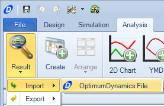

####[Return to Start](1_Tutorial_3.md)

1) [Importing Results](2_Importing_Results.md)|2) [Creating a Worksheet](3_Create_Worksheet.md)|3) [Create Table](4_CreateTable.md)|4) [Create 2D Plot](5_2DChart.md)
-|-|-|-
__5) [Create Contour Chart](6_ContourChart.md)__|__6) [Comparison Plot](7_CompPlot.md)__|__7) [Create YMD Plot](8_YMDPlot.md)__|__8) [Create Track Map](9_TrackMap.md)__
__9) [Reporting Simulation Data](10_SimReport.md)__|__10) [Math Channels](11_MathChan.md)__|__11) [Conclusions](12_Conclusion.md)__

#Importing Results

Results can only be imported into OptimumDynamics as an OptimumDynamics native file. We are going to import a provided data result which can be downloaded __[here](../track_tire_replay.ODRes)__ To import a result file:

1) Go to the __Import__ option under the __Results__ button.

2) Select __OptimumDynamics File__ and search the directory for the downloaded results files

3) Create a new __Folder__ for the file

4) __Move__ the file into the folder by dragging and dropping the file

###[Next: Create a Worksheet](3_Create_Worksheet.md)
---
###[Previous: Introduction](1_Tutorial_3.md)