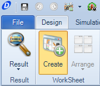
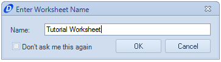
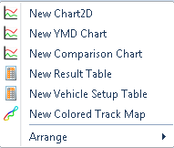
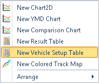
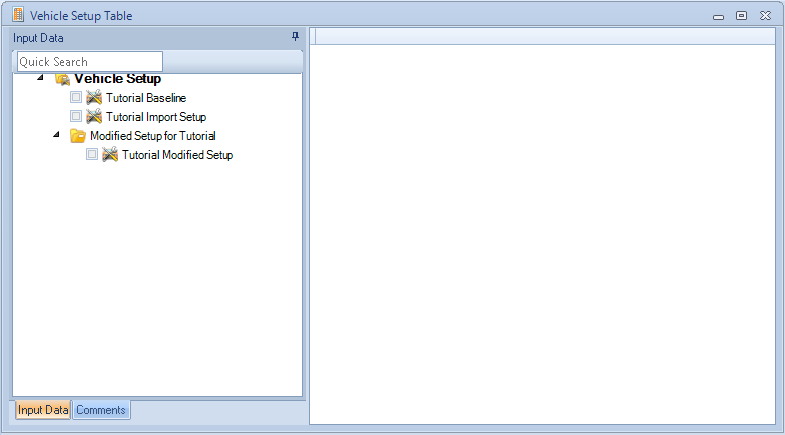
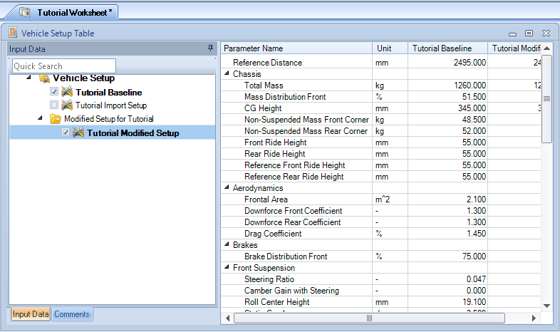
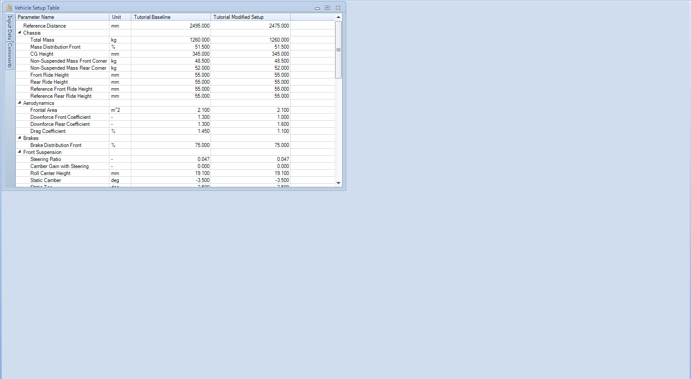
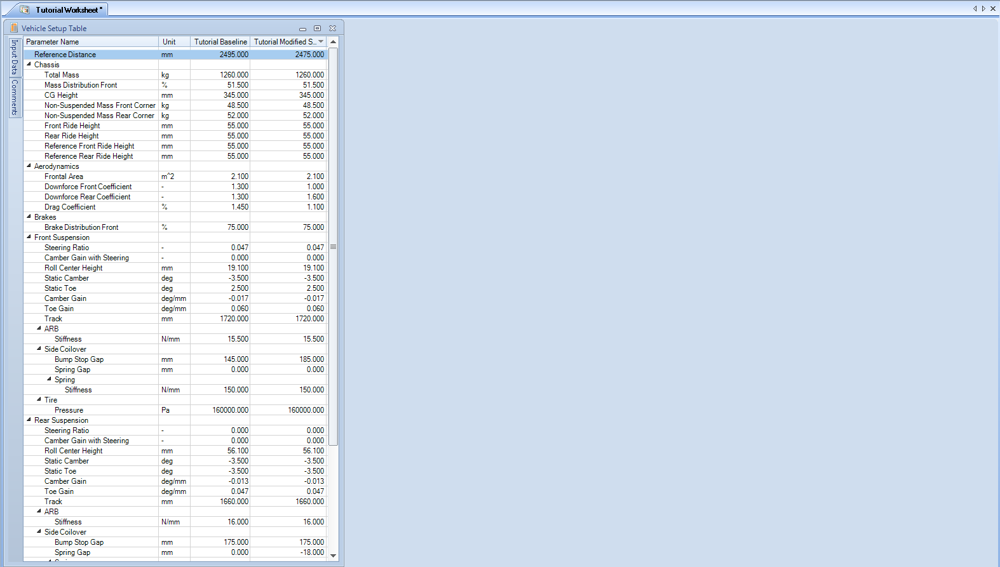

####[Return to Start](1_Tutorial_3.md)

1) [Importing Results](2_Importing_Results.md)|2) [Creating a Worksheet](3_Create_Worksheet.md)|3) [Create Table](4_CreateTable.md)|4) [Create 2D Plot](5_2DChart.md)
-|-|-|-
__5) [Create Contour Chart](6_ContourChart.md)__|__6) [Comparison Plot](7_CompPlot.md)__|__7) [Create YMD Plot](8_YMDPlot.md)__|__8) [Create Track Map](9_TrackMap.md)__
__9) [Reporting Simulation Data](10_SimReport.md)__|__10) [Conclusions](11_Conclusion.md)__

#Create a Worksheet

Worksheets are a means within OptimumDynamics that provides the user options to have multiple plots open at once. This can help create standardized reports that can aid in expediting the process of data analysis. We are going to create a worksheet and with each feature expand the content within our worksheet.

Here are the steps to get started:

1) Under the __Analysis__ tab, click on the __Worksheet__ button.

2) Provide a name for the worksheet as shown above

3) A blank sheet will now appear in the __Document Manager__. We will need to create the content for the sheet now.

4) __Right click__ in the worksheet area. We now have the options for content that we can add to the chart. We will go over each one shortly.

5) Select the __New Vehicle Setup Table__ option. This will show all of the parameters for the vehicle setup in a tabular format.

6) In the left hand column of the new table, select the __baseline__ setup and the modified setup. __Check__ the boxes that correspond to the name of the setup.

7) While content has now appeared, we want to make it more visible. Using the , hide the __Input Data__ selection tool

8) We can now see both of the columns for the setup. However, the columns are taking up a significant amount of space. __Drag__ the bottom-right corner of the table window, and adjust it so that only the columns can be seen.

9) We now have plenty of room for supplemental plots and analysis. __Save__ the file, we will come back to it shortly

###[Next: Create a Table](4_CreateTable.md)
---
###[Previous: Importing Results](2_Importing_Results.md)