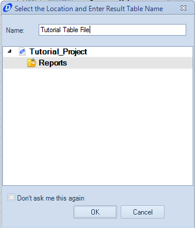

####[Return to Start](1_Tutorial_3.md)

1) [Importing Results](2_Importing_Results.md)|2) [Creating a Worksheet](3_Create_Worksheet.md)|3) [Create Table](4_CreateTable.md)|4) [Create 2D Plot](5_2DChart.md)
-|-|-|-
__5) [Create Contour Chart](6_ContourChart.md)__|__6) [Comparison Plot](7_CompPlot.md)__|__7) [Create YMD Plot](8_YMDPlot.md)__|__8) [Create Track Map](9_TrackMap.md)__
__9) [Reporting Simulation Data](10_SimReport.md)__|__10) [Math Channels](11_MathChan.md)__|__11) [Conclusions](12_Conclusion.md)__

#Create a Table of Values

The next thing we are going to add to our worksheet is a __Results Table__. The table can be used to compare direct values between different setup configurations.

To create a table, we can either create it within the worksheet or create a standalone table. We will start by creating a table within the worksheet.

To do so:

1) Right click in the chart area and select the __New Result Table__ option.

2) The table will now generate. However, will need to move it if we want to see both the setup table and results table. __Click__ on the top of the table window and __Drag__ the table to the open area of the worksheet.

3) Adjust the sizing of the table so that it runs along the full length of the area similar to as shown above.

4) The contents of the table are controlled by the interface shown above. The highlighted tab tool is used to display either the __Channel Selection Tool__ or the __Results Selection Tool__.

5) For the results, select the results that were created within the __Batch Simulation__

6) Check the __Compare__ box. This outputs the results as a difference from the baseline.

7) Using the __Search Tool__, find the __Chassis Roll Angle__ parameter and check the box for the output.

8) Repeat step 7 for the __Lateral Load Transfer Distribution__ of the vehicle. Then __unpin__ the __Selection Tool__.

9) We can now scroll through and see the variances for our different setups for the batch simulation. Notice that we have a __Maximum__, __Minimum__, __Average__, __Variance__, __Initial Value__, __Final Value__, and __Standard Deviation Value__ immediately available in view. If you __scroll__ within the table, we can also see each step from the simulation.

A stand alone table works comparable to the worksheet table, but is created in its own file instead of the worksheet table. To create the __Table__ report:

1) Click on the __Table__ button in the __Command Ribbon__

2) Provide a name for the table file

3) On the left hand side of the __Document Manager__, click on the __Input Data__ tab. Pin down the __Selection Tool__ while we are working within it.

4) From here, all of the features are going to behave the same as within the worksheet table. Generate a table with the __Batch Simulation__ results, and the __Chassis Heave Displacement__ output data.

###[Next: Create a 2D Plot](5_2DChart.md)
---
###[Previous: Create a Worksheet](3_Create_Worksheet.md)