####[Return to Start](1_Tutorial_3.md)

1) [Importing Results](2_Importing_Results.md)|2) [Creating a Worksheet](3_Create_Worksheet.md)|3) [Create Table](4_CreateTable.md)|4) [Create 2D Plot](5_2DChart.md)
-|-|-|-
__5) [Create Contour Chart](6_ContourChart.md)__|__6) [Comparison Plot](7_CompPlot.md)__|__7) [Create YMD Plot](8_YMDPlot.md)__|__8) [Create Track Map](9_TrackMap.md)__
__9) [Reporting Simulation Data](10_SimReport.md)__|__10) [Conclusions](11_Conclusion.md)__

#Create a 2D Plot

The 2D Plot is a visual tool that can show any comparison of data between the x and y axis. This will be used for any multitude of vehicle components. Like the table, the plots can be created in both the worksheet interface and in a stand alone file.

To create the 2D plot within the worksheet:

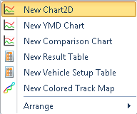

1) __Right Click__ on the open chart area and select the __New 2D Plot__ option.

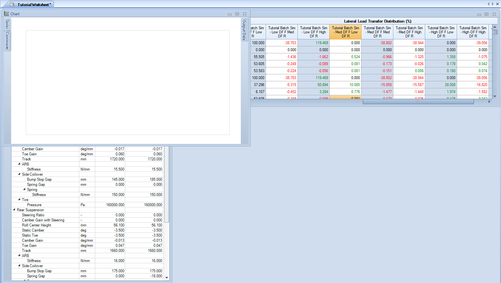

2) Notice that the chart will have to be moved. __Click__ and __Drag__ using the top header to move it into an open position. Scale the plot down to about a quarter of the open space and __Create__ a second plot.

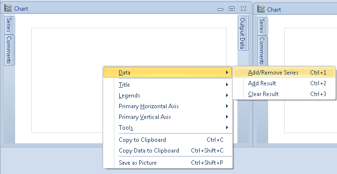

3) We can now add data to the plot. __Right Click__ on the first of the plots.

4) Go to __Data->Add/Remove Series__

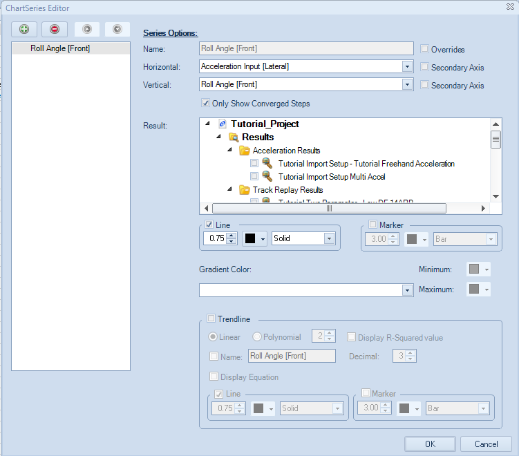

5) The __Chart Series Editor__ now appears. From here we can set what output data we are plotting, what the data sets are, and how the data should be plotted. 

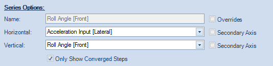

6) The __Series Options__ shows the output data that we are going to plot on the 2D Chart. For this particular plot, we are going to do __Roll Angle__ plotted against __Lateral Acceleration__. 

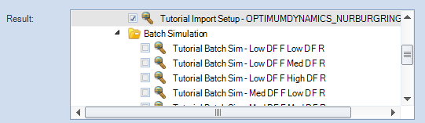

7) The __Result Options__ tool sets the data types that we are going to show on the 2D Plot. For our plot, we are going to compare the __Batch Simulation Baseline__ and the __Tutorial Import Setup__

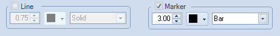

8) The __marker options__ can be used to display each raw data point or a line connecting the step points. We are going to put a trendline on this plot, so set this to __marker__.

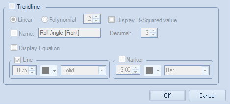

9) The bottom section of the editor has the option to create a __trendline__. Check the box next to the header of the section. We will leave the line as a linear function for now

10) __Check__ the option to name the trendline and to display the equation

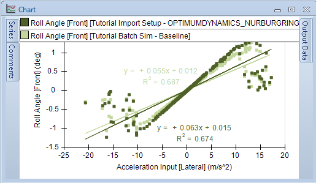

11) Click __OK__. The resulting plot should look similar to the one above

For the second plot, we are going to compare __Coilover Displacement__ over __Time__ for the right front coilover. However, we are also going to plot the additional channel we created in the __Acceleration Input__ that showed the damper position on the actual car. Here are the steps that we will follow:

1) Go to the __Chart Series Editor__ using the process described in steps 3 and 4.

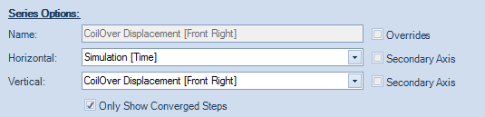

2) In the __Series Options__, set the horizontal axis to be the __Simulation Time__ and the vertical axis to be the __Coilover Displacement__.

3) The __Results__ used will be the __Batch Simulation Baseline__.

4) Change the __Color__ in the __Marker Options__ to __Green_

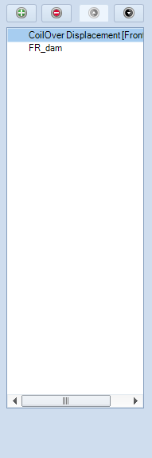

5) In the left hand __Series__ table, click on the green __Add__ button to add another series to the plot

6) In the __Series Options__ section, set the horizontal axis to be __Time__ and the vertical axis to be the additional input channel you created. In the case of the tutorial, it is __FR_Dam__

7) Use the __Result Options__ tool to set the data series used to the __Batch Simulation Baseline__ result

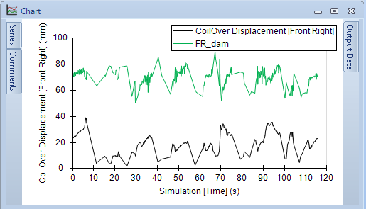

8) Click __OK__, the resulting plot should look like something shown above

To create a standalone plot, the only change in any of the interface is the button to create it. To create the plot:

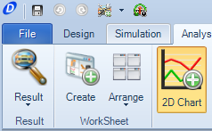

1) __Click__ on the __Plot__ button located along the __Command Ribbon__.

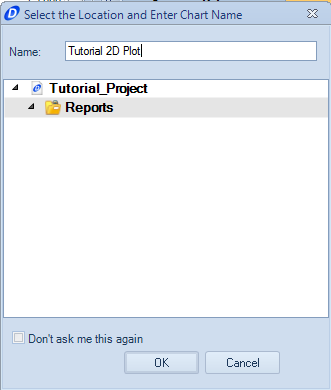

2) Provide a name for the plot

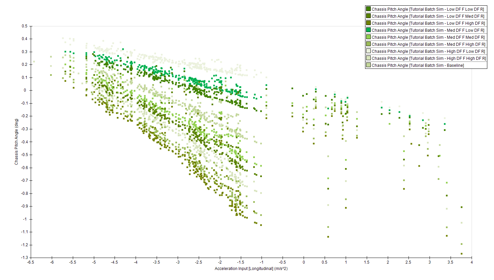

3) Input the output data and results series as done in the previous sequence. This plot is going to show __Longitudinal Acceleration__ versus __Pitch Angle__ for all of the batch simulation results. Use __markers__ to show the gradients of each series as shown above

###[Next: Create a Contour Plot](6_ContourChart.md)
---
###[Previous: Create a Table](4_CreateTable.md)