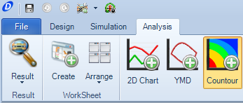
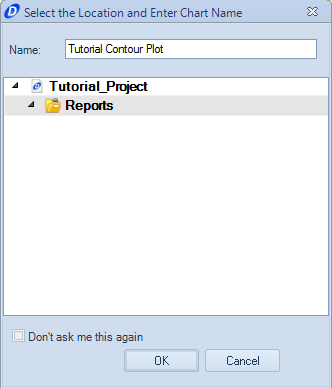
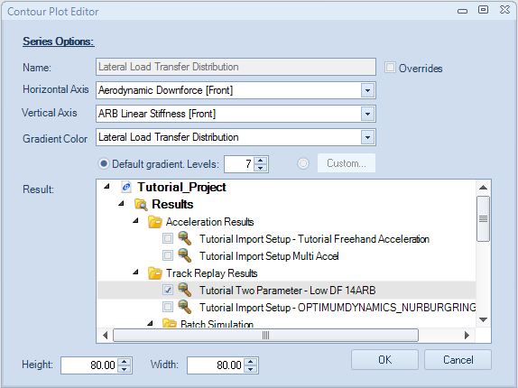
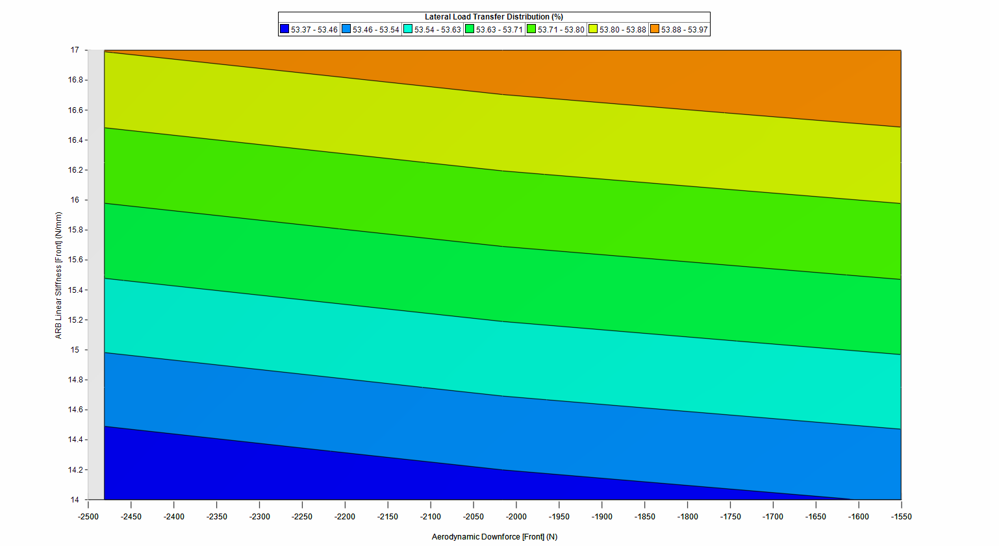

####[Return to Start](1_Tutorial_3.md)

1) [Importing Results](2_Importing_Results.md)|2) [Create a Worksheet](3_Create_Worksheet.md)|3) [Create Table](4_CreateTable.md)|4) [Create 2D Plot](5_2DChart.md)
-|-|-|-
__5) [Create Contour Chart](6_ContourChart.md)__|__6) [Comparison Plot](7_CompPlot.md)__|__7) [Create YMD Plot](8_YMDPlot.md)__|__8) [Create Track Map](9_TrackMap.md)__
__9) [Reporting Simulation Data](10_SimReport.md)__|__10) [Conclusions](11_Conclusion.md)__

#Create a Contour Plot

The contour plot is a featured plot within OptimumDynamics that can be used to compare two different parameters and see the net effect they have on a result. The contour plot is often created based off the output data from a __Two-Parameter Study__. Unlike the other plots, a contour plot cannot be put into a worksheet.

To create a contour plot:

1) Click on the __Contour__ button located along the __Command Ribbon__

2) Provide a name for the contour plot

3) The __Contour Plot Editor__ now comes up. We now have options to set the __Horizontal Axis__ the __Vertical Axis__ and the __Gradient Series__.

4) Set the __Horizontal Axis__ to be the Front Downforce of the vehicle

5) Set the __Vertical Axis__ to be the Front Anti-Roll Bar Stiffness

6) Set the __Gradient Color__ to be the Lateral Load Transfer Distribution of the Vehicle

7) Set the __Results Series__ to be the Two Parameter Study in the Results Table.

8) Click __OK__. The plot should look comparable to the one listed above

###[Next: Create a Comparison Plot](7_CompPlot.md)
---
###[Previous: Create a 2D Chart](5_2DChart.md)