####[Return to Start](1_Tutorial_3.md)

1) [Importing Results](2_Importing_Results.md)|2) [Creating a Worksheet](3_Create_Worksheet.md)|3) [Create Table](4_CreateTable.md)|4) [Create 2D Plot](5_2DChart.md)
-|-|-|-
__5) [Create Contour Chart](6_ContourChart.md)__|__6) [Comparison Plot](7_CompPlot.md)__|__7) [Create YMD Plot](8_YMDPlot.md)__|__8) [Create Track Map](9_TrackMap.md)__
__9) [Reporting Simulation Data](10_SimReport.md)__|__10) [Math Channels](11_MathChan.md)__|__11) [Conclusions](12_Conclusion.md)__

#Creating a Comparison Plot

A comparison plot can be used to compare the magnitudes of results from a single state acceleration. To create this plot, we are going to need to run an additional simulation series.

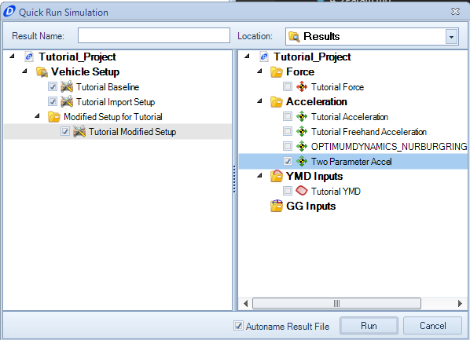

1) __Quick Run__ the __Tutorial Import Setup__, __Baseline Setup__, and the __Tutorial Modified Setup__ with the __Two Parameter Acceleration__ input.

2)__Create__ a folder for the newly created simulations.

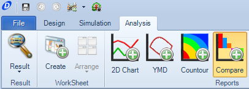

3) Select the __Comparison Plot__ option on the __Command Ribbon__

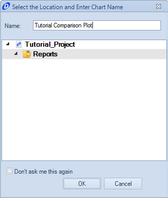

4) Provide a name for the comparison plot. Then click __OK__

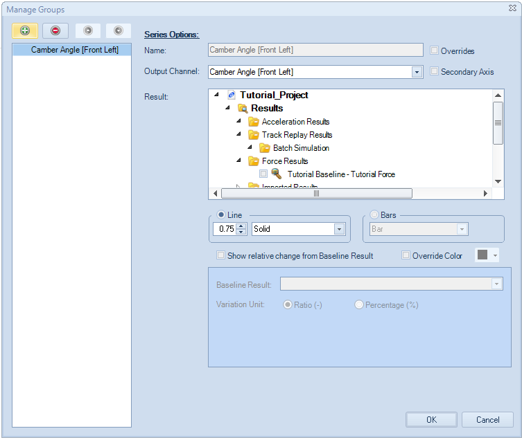

5) The __Manage Groups__ editor now comes up. This is where the vehicle parameters to analyze can be chosen and what data sets will be analyzed.

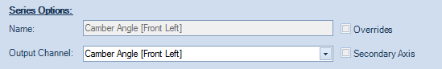

6) We are going to analyze the __Camber Angle__ with this comparison. Therefore, input __Camber Angle__ into the __Output Channel__.

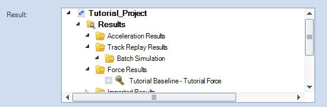

9) Select the three simulations we just created using the __Results__ selection area.

10) Set the marker style to a __bar__ style. We are going to leave the baseline relativity off for this plot.

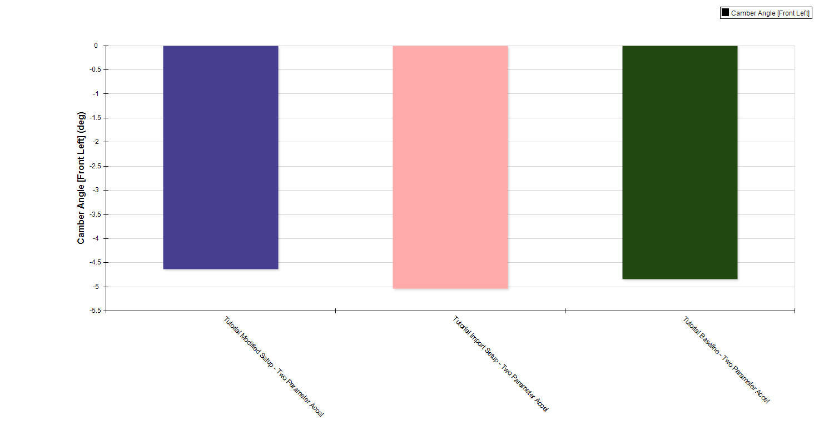

11) Click __OK__. The final output should look like the image above.

We can also add secondary results on the comparison plot. We are going to do so within the worksheet we opened earlier.

To create this plot.

1) Open the __Tutorial Worksheet__ we have been working on (if not already opened)

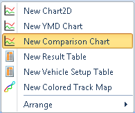

2) __Right Click__ in the open space and select __New Comparison Plot__

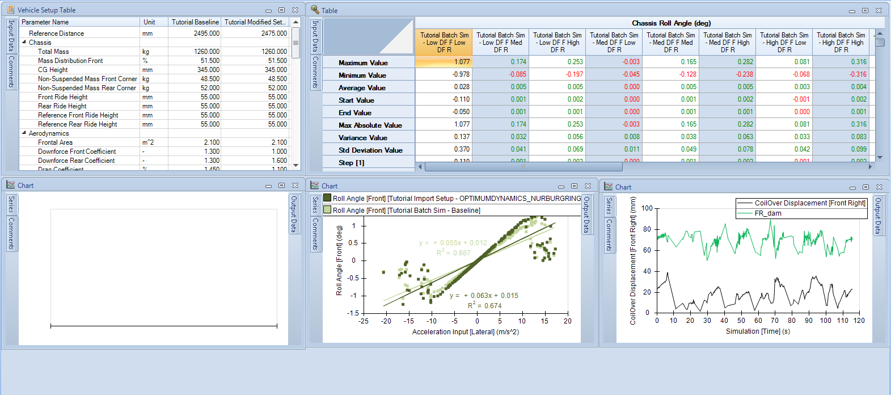

3) Adjust the setup table to make room for the comparison plot while still leaving room along the bottom.

4) Create a first entry into the comparison plot by selecting __Heave Displacement__ in the __Output Channel__ and choosing the three single state acceleration simulations.

5) Set the marker style to __Bar__

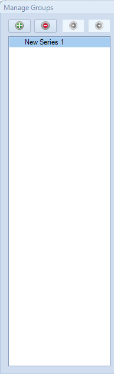

6) In the right hand column of the window, click on the green __Add Series__ button.

7) For the new channel, select the __Chassis Roll Angle__ output channel and set the marker style to __Bar__

8) Create a third series, this time using the output channel __Chassis Pitch Angle__

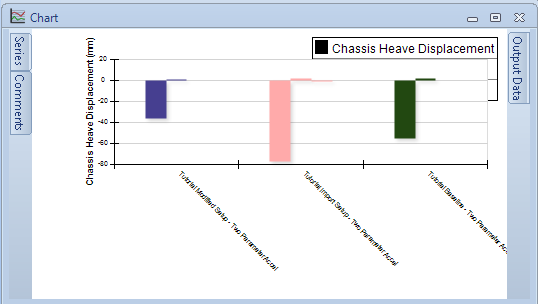

9) Click __OK__. The resulting plot should look like the one above. 

Notice that the two angle measurements get lost with the displacement. We will change that by adding a secondary axis

10) Go back into the __Add/Remove Series__ option. check the box next to the output channel for __Secondary Axis__ for the __Chassis Roll Angle__ and the __Chassis Pitch Angle__

11) Click __OK__. The two smaller bars should now be much more visible. However, the plot is not the easiest to read right now because the two bars do not share a common origin. We can fix that.

12) We are going to make this comparison a relative comparison. To do so, go back into __Add/Remove Series__ once more.

13) __Deselect__ the secondary axis option for the two angles, and check the __Show Relative to Baseline__ option

14) Set the baseline result to be the __Tutorial Baseline - Two Parameter Accel__ result. Leave the ratio measurement checked.

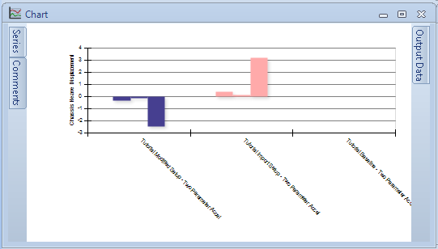

15) Click __OK__, the result should look like the plot above

###[Next: Create a YMD Plot](8_YMDPlot.md)
---
###[Previous: Create a Contour Chart](6_ContourChart.md)