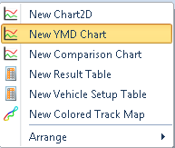
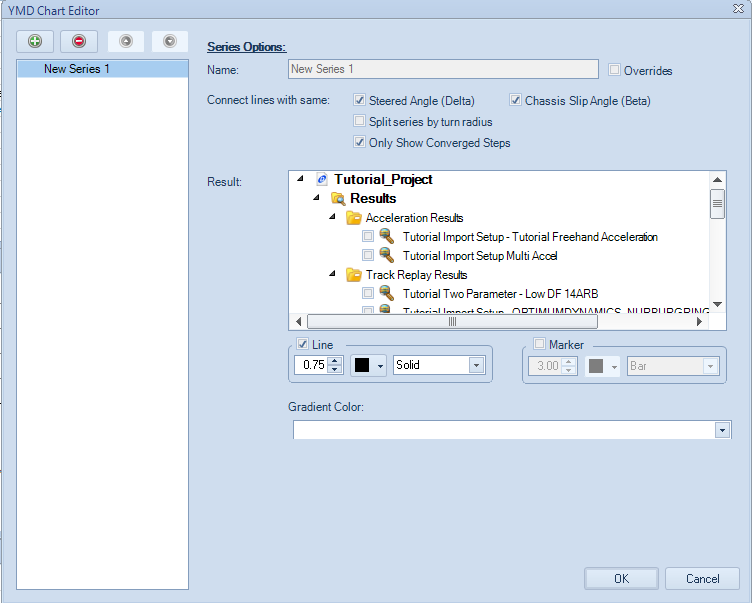
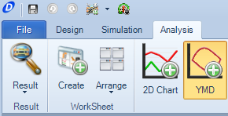
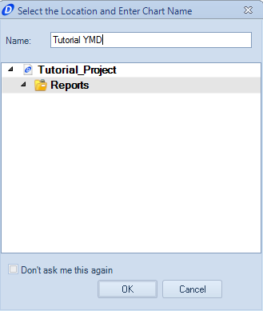
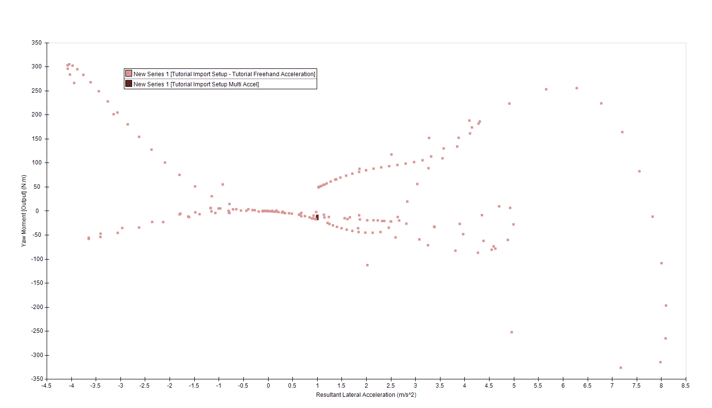

####[Return to Start](1_Tutorial_3.md)

1) [Importing Results](2_Importing_Results.md)|2) [Create a Worksheet](3_Create_Worksheet.md)|3) [Create Table](4_CreateTable.md)|4) [Create 2D Plot](5_2DChart.md)
-|-|-|-
__5) [Create Contour Chart](6_ContourChart.md)__|__6) [Comparison Plot](7_CompPlot.md)__|__7) [Create YMD Plot](8_YMDPlot.md)__|__8) [Create Track Map](9_TrackMap.md)__
__9) [Reporting Simulation Data](10_SimReport.md)__|__10) [Conclusions](11_Conclusion.md)__

#Create a YMD Plot

The Yaw Moment Diagram Plot is a tool that can be used for understanding the behavior of your vehicle in relation to its chassis slip angle, steering input, lateral acceleration, and yaw moment. The plot can either be created from raw data or from a full yaw moment simulation and is available for use as both a standalone plot and as an embedded worksheet plot.

To create the embedded Yaw Moment Plot:

1) __Right Click__ on the open space within the worksheet and select the __New YMD Chart__ option. Move the plot into an open position.

2) Go to the __Add/Remove Series__ option and bring up the __YMD Chart Editor__

3) Select the __Batch Simulation High DF F High DF R__ and the __Low DF F Low DF R__ results.

4) Change the __Marker Style__ from __line__ to __marker__

5) Do not apply a gradient to the series. The results should look like the plot above

To create a standalone Yaw Moment Diagram:

1) Select the __YMD__ option listed along the __Command Ribbon__

2) Provide a name for the Yaw Moment Diagram

3) Create a plot with the two multiple state yaw moment diagrams. Notice that the constant acceleration state plot maintains a nearly constant yaw moment through its steps.

###[Next: Create a Track Map Analysis](9_TrackMap.md)
---
###[Previous: Create a Comparison Plot](7_CompPlot.md)