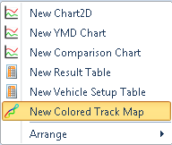
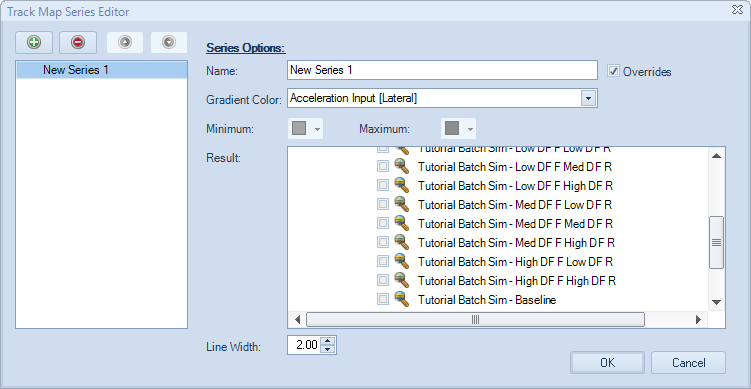
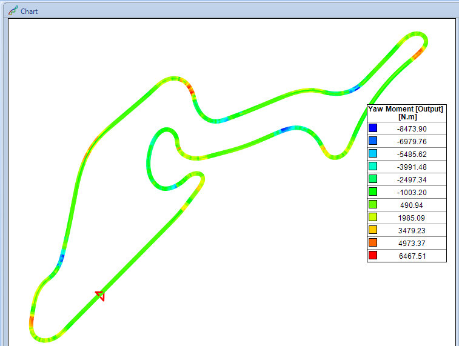
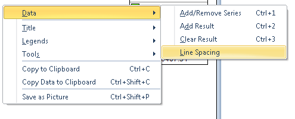
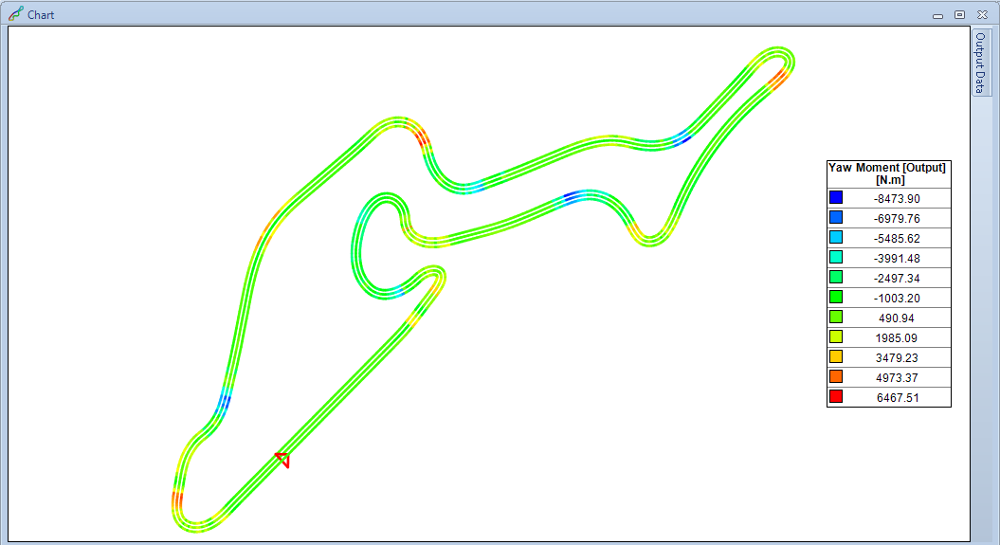
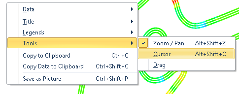
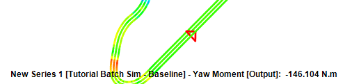

####[Return to Start](1_Tutorial_3.md)

1) [Importing Results](2_Importing_Results.md)|2) [Create a Worksheet](3_Create_Worksheet.md)|3) [Create Table](4_CreateTable.md)|4) [Create 2D Plot](5_2DChart.md)
-|-|-|-
__5) [Create Contour Chart](6_ContourChart.md)__|__6) [Comparison Plot](7_CompPlot.md)__|__7) [Create YMD Plot](8_YMDPlot.md)__|__8) [Create Track Map](9_TrackMap.md)__
__9) [Reporting Simulation Data](10_SimReport.md)__|__10) [Conclusions](11_Conclusion.md)__

#Create a Track Map

The track map is a plotting method that can show specific vehicle outputs as they occur on the defined course. The plot can either be an embedded piece or can be setup as a stand alone analysis. The track map does require an acceleration input that was created with time or distance as the x-component.

To create the track playback in a worksheet:

1) __Right Click__ on an open area of the worsheet and select the option for __New Colored Track Map__. Move the plot to an open area of the plot

2) __Right Click__ in the chart area and bring up the __Add/Remove Series__ option. The __Track Map Series Editor__ comes up.

3) We are going to plot three of the different batch simulations. The __Baseline__ Simulation, the __High F DF High R DF__ simulation, and the __Low F DF Low R DF__. Select the three in the results option

4) Set the __Gradient Color__ to be the __Yaw Moment__ of the vehicle.

5) Click __OK__, the results now show on the plot. However, we cannot differentiate between the three. We can fix that though the options for the plot.

6) __Right click__ on the chart area. Go to __Data->Line Spacing__

7) Increase the line spacing to 10. The change should look like the above plot.

8) We can also turn on the __Cursor__ to read data on the plot at various points. __Right Click__ on the white space of the plot and select __Tools -> Cursor__.

9) __Hover__ on the plot now. Notice that the ouput data for each point will come up along with the simulation it came from.

###[Next: Reporting Simulation Outputs](10_SimReport.md)
---
###[Previous: Create a YMD Plot](8_YMDPlot.md)