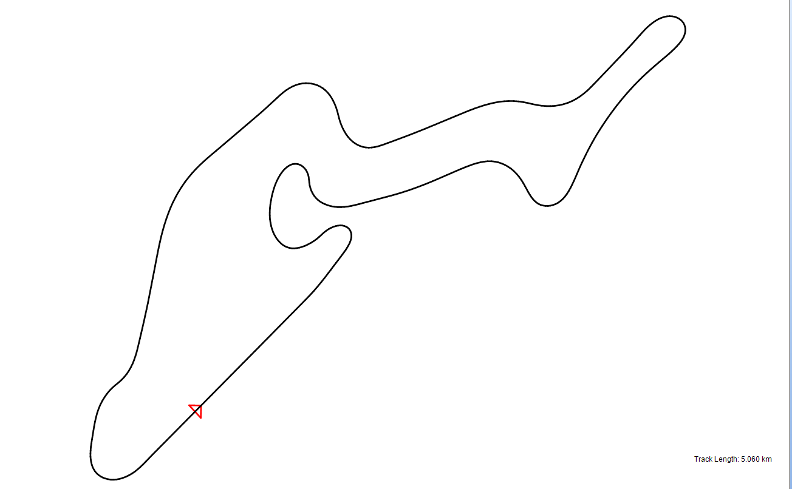

#Tutorials

Tutorials for beginning your work can be accessed here.  Each topics is ordered step by step so that you can follow along and create your first project.

###__[Tutorial 1: Vehicle Design](Tutorial_1_Vehicle_Design/1_Tutorial_1.md)__

This tutorial goes over the steps required to create a vehicle setup and set parameters for the vehicle so that the setup can be used in simulation functions.

###__[Tutorial 2: Vehicle Simulation](Tutorial_2_Vehicle_Simulation/1_Tutorial_2.md)__

This tutorial explains how to create the inputs for a vehicle simulation and enact the simulations using the fundamental simulation functions

###__[Tutorial 3: Setup Modification](Tutorial_3_Modifying_Vehicle_Setup/1_Tutorial_4.md)__

This tutorial explains how to make changes to a vehicle setup after creating a preliminary setup and running initial vehicle simulations.  We also explore how to use the batch simulation and two-parameter study simulation functions.

###__[Tutorial 4: Post Processing Simulations](Tutorial_4_Post_Processing_Simulations/1_Tutorial_3.md)__

This tutorial covers the analysis section of the software.  We go over how to create different output plots, organize functions using the worksheet tool, and output results so that they can be used in a report.